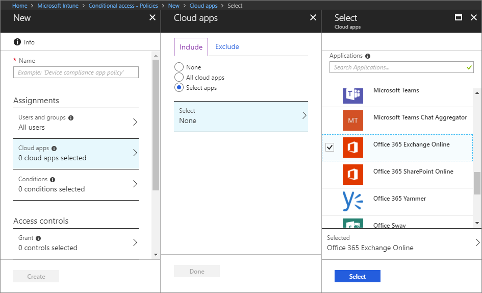

---
# required metadata

title: Set up device-based Conditional Access with Intune
titleSuffix: Microsoft Intune
description: Learn how to create a device-based Conditional Access policy based on Microsoft Intune device compliance and mobile app management.
keywords:
author: brenduns
ms.author: brenduns
manager: dougeby
ms.date: 02/22/2019
ms.topic: conceptual
ms.service: microsoft-intune
ms.localizationpriority: high
ms.technology:
ms.assetid: 

# optional metadata

#ROBOTS:
#audience:
#ms.devlang:
ms.reviewer:
ms.suite: ems
#ms.tgt_pltfrm:
ms.custom: intune-azure
ms.collection: M365-identity-device-management
---

# Create a device-based Conditional Access policy

With Intune, you can enhance Conditional Access in Azure Active Directory by adding mobile device compliance to the access controls. Once you’ve created an Intune compliance policy that defines the requirements for devices to be compliant, you can use a device’s compliance status to either allow or block access to your apps and services. You can do this by creating a Conditional Access policy that uses the setting **Require device to be marked as compliant**.  

A Conditional Access policy specifies the app or services you want to protect, the conditions under which the apps or services can be accessed, and the users to whom the policy applies. Conditional Access is an Azure AD premium feature that is configurable in Azure Active Directory, but you can also set up these same policies from within the Intune portal. The Conditional Access node accessed from *Intune* is the same node as accessed from *Azure AD*.  

> [!IMPORTANT]
> Before you set up Conditional Access, you'll need to set up Intune device compliance policies to evaluate devices based on whether they meet specific requirements. See [Get started with device compliance policies in Intune](device-compliance-get-started.md).

## Create Conditional Access policy

1. In the Intune portal, select **Conditional Access** > **Policies** > **New policy**.
   
    
 
2. Under **Assignments**, select **Users and groups**. 
3. On the **Include** tab, identify the users or groups to whom you want this Conditional Access policy to apply. Once you’ve chosen whom to include, you can use the **Exclude** tab if there are any users, roles, or groups you want to exclude from this policy.  
    - **All users**: Select this option to apply the policy to all users and groups, including internal and guest users.
  
    - **Select users and groups**: Select this option and specify one or more of the following options:
  
      a. **All guest users**: Select this option to include or exclude external guest users (for example, partners, external collaborators)
       
      b. **Directory roles**: Select one or more Azure AD roles to include or exclude users who are assigned these roles.
      
      c. **Users and groups**: Select this option to search for and select individual users or groups you want include or exclude.
     
       > [!TIP]  
       > Test the policy against a smaller group of users to make sure it works as expected.
4. Select **Done**.
5. Under **Assignments**, select **Cloud apps**. 
6. On the **Include tab**, identify the apps and services you want to protect with this Conditional Access policy. Then you can use the **Exclude** tab if there are any apps or services you want to exclude from this policy.
    - **All cloud apps**: Select this option to apply the policy to all apps.
      > [!IMPORTANT]  
      > The Microsoft Azure Management app for access to the Azure portal is included in this list. Be sure to use the **Exclude** tab either here or in the **Users and groups** options to make sure you (or the users or groups you designate) will be able to sign in to the Azure portal. 

    - **Select apps**: Select this option, choose **Select**, and then use the applications list to search for and select the apps or services you want to protect.
    
      

7. Select **Done**.
8. Under **Assignments**, select **Conditions**.
    - **Sign-in risk**: Choose Yes to use Azure AD Identity Protection sign-in risk detection with this policy, and then choose the sign-in risk levels the policy should apply to.
    - **Device platforms**: On the **Include** tab, identify the device platforms you want to this Conditional Access policy to apply to. Use the **Exclude** tab to exclude platforms from this policy.
    - **Locations**: On the **Include** tab, specify whether the policy applies to any location, trusted network locations that are under the control of your IT department, or specific network locations. Use the **Exclude** tab to exclude network locations from this policy. 
    - **Client apps**: Choose **Yes** to specify if the policy should apply to browser apps, mobile apps, and desktop clients. You can also select **Modern authentication clients** (such as Outlook for iOS or Outlook for Android) and **Exchange ActiveSync clients**.
    - **Device state**: The Conditional Access policy will apply to all device states unless you choose Yes and specifically exclude the states Device Hybrid Azure AD joined or Device marked as compliant (or both).
    
      

      > [!TIP]  
      > If you want to protect both **Modern authentication** clients and **Exchange ActiveSync clients**, create two separate Conditional Access policies, one for each client type. Although Exchange ActiveSync supports modern authentication, the only condition that is supported by Exchange ActiveSync is platform. Other conditions, including multi-factor authentication, are not supported. To effectively protect access to Exchange Online from Exchange ActiveSync, create a Conditional Access policy that specifies the cloud app Office 365 Exchange Online and the client app Exchange ActiveSync with Apply policy only to supported platforms selected.

9. Select **Done**.
10. Under **Access controls**, select **Grant**. Configure what happens based on the conditions you’ve set up.  You can select from the following options:
    - **Block access**: The users specified in this policy will be denied access to the apps under the conditions you’ve specified.
    - **Grant access**: The users specified in this policy will be granted access, but you can require any of the following further actions:
      - **Require multi-factor authentication**: The user will need to complete additional security requirements, like a phone call or text.
      - **Require device to be marked as compliant**: The device must be Intune compliant. If the device is noncompliant, the user will be given the option to enroll the device in Intune. 
      - **Require Hybrid Azure AD joined device**: Devices must be Hybrid Azure AD joined.
      - **Require approved client app**: The device must use approved client apps. 
      - **For multiple controls**: Select **Require all the selected controls** so that all of the requirements above are enforced when a device attempts to access the app.
    
      
 
11. Under **Enable policy**, select **On**.
     
     

12. Select **Create**.

## See also
[App-based Conditional Access with Intune](app-based-conditional-access-intune.md)

[Troubleshooting Intune Conditional Access](https://support.microsoft.com/help/4456106)
