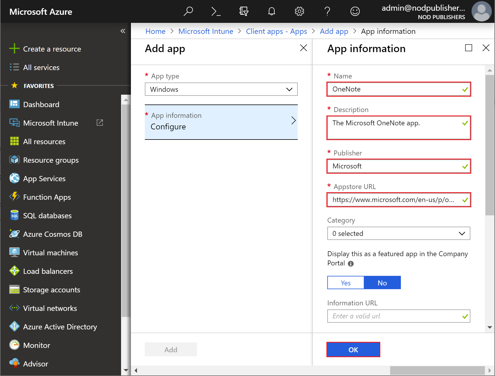

---
# required metadata

title: Quickstart - Add and assign a client app
titlesuffix: Microsoft Intune
description: In this quickstart you will use Microsoft Intune to add an assign a client app.
keywords:
author: Erikre
ms.author: erikre
manager: dougeby
ms.date: 11/08/2018
ms.topic: quickstart
ms.prod:
ms.service: microsoft-intune
ms.technology:
ms.assetid: dab6f5c8-1ebb-42c4-a7a7-7af001f94e15

# optional metadata

#ROBOTS:
#audience:
#ms.devlang:
ms.reviewer:
ms.suite: ems
#ms.tgt_pltfrm:
ms.custom: intune-azure

---

# Quickstart: Add and assign a client app

In this quickstart, you will use Intune to add and assign a client app to your company's workforce. One of an admin's priorities is to ensure that end users have access to the apps they need to do their work. 

If you don’t have an Intune subscription, [sign up for a free trial account](free-trial-sign-up.md).

## Prerequisites

- To complete this quickstart, you must:
    - [Create a user](quickstart-create-user.md)
    - [Create a group](quickstart-create-group.md)
    - [Enroll a device](quickstart-setup-auto-enrollment.md)

## Locate an app from the Microsoft store

1. In a browser, navigate to the Microsoft store:
    [https://www.microsoft.com/store/collections/essentialapps/pc](https://www.microsoft.com/store/collections/essentialapps/pc)
2. Find and select the **Microsoft To-Do** app. 
3. Copy and save the URL of the **Microsoft To-Do** app. You'll use the URL later in this quickstart.

## Sign in to Intune

Sign in to the [Intune](https://aka.ms/intuneportal) as a [Global administrator or an Intune Service administrator](users-add.md#types-of-administrators). If you have created an Intune Trial subscription, the account you created the subscription with is the Global administrator.

## Add the client app to Intune

An app can be included so that Intune can manage aspects of the app. 

Use the following steps to add an app to Intune:

1. In [Intune](https://aka.ms/intuneportal), select **Client apps** > **Apps** > **Add**. 
2. Select **Windows** in the **Store app** section of the **App type** dropdown box.
3. Select **App information** to configure the app.
4. Enter **Contoso's To-Do** as the **Name**.
5. Enter **The To-Do list app.** as the **Description**.
6. Enter **Microsoft** as the publisher.
7. Enter the URL that you [previously saved during this quickstart](quickstart-add-assign-app.md#locate-an-app-from-the-microsoft-store) in the **Appstore URL** box.

    

8. Click **Yes** next to **Display this as a featured app in the Company Portal**. 
9. Click **OK** > **Add**.

## Assign the app to a group

After you've added an app to Microsoft Intune, you can assign the app to groups of users or devices.

> [!NOTE]
> This quickstart build on previous quickstarts in this series. Please see [prerequisites](quickstart-add-assign-app.md#prerequisites) in this quickstart for details.

Use the following steps to assign an app to a group:
1. In [Intune](https://aka.ms/intuneportal), select **Client apps** > **Apps**. 
2. Select the app that you want to assign to a group.	
3. Click **Assignments** > **Add group** to display the **Add group** blade.
4. Select **Available for enrolled devices** in the **Assignment type** dropdown box. 
5. Click **Included Groups** > **Select groups to include** > **Contoso Testers**.
6. Click **Select** > **OK** > **OK** > **Save** to assign the group.

You now have assigned the app to the **Contoso Testers** group.

## Verify the app on the enrolled device

You must install and use the Company Portal app to install the **Contoso's To-Do** app made available by Intune. Use the following steps to verify that the app is available to the user of the enrolled device.

1. Log in to your enrolled Windows 10 Desktop device.

    > [!IMPORTANT]
    > The device must be [enrolled with Intune](quickstart-enroll-windows-device.md). Also, you must sign in to the device using an account contained in the group you assigned to the app.

2. From the **Start** menu, open the **Microsoft Store**. Then, find the **Company Portal** app and install it.
3. Launch the **Company Portal** app.
4. Find the app that you added using Intune. In this quickstart you added the **Contoso's To-Do** app.
5. Click **View in Microsoft Store**.
6. Click **Install**.  **Install on my devices**.
7. Install the app to your current Windows 10 Desktop device.

If your business needs require that you assign the Company Portal app to your workforce, you can manually assign the Windows 10 Company Portal app directly from Intune. For more information see, [Manually add the Windows 10 Company Portal app by using Microsoft Intune](store-apps-company-portal-app.md).

## Next steps

In this quickstart, you locateed an app from the Microsoft store, added the app to Intune, assigned the app to a group, and verified the availability of the app on the enrolled Windows 10 Desktop device. 

> [!div class="nextstepaction"]
> [Quickstart: Create and assign an app protection policy](quickstart-create-assign-app-policy.md)
