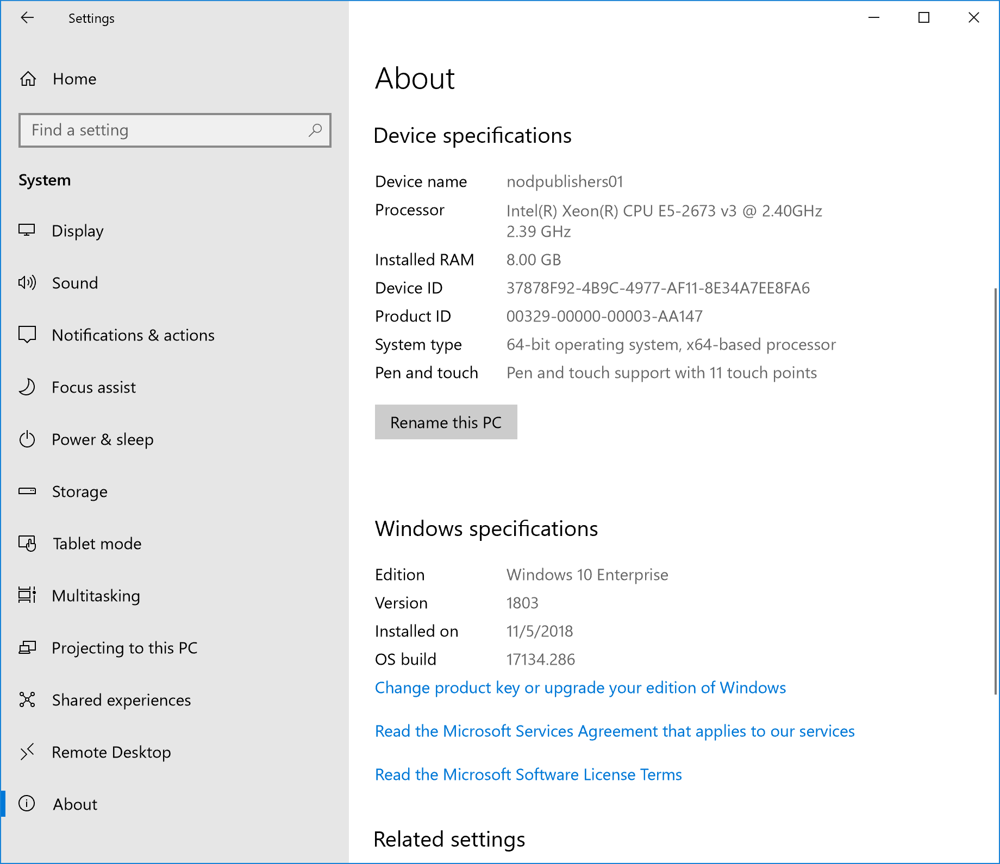
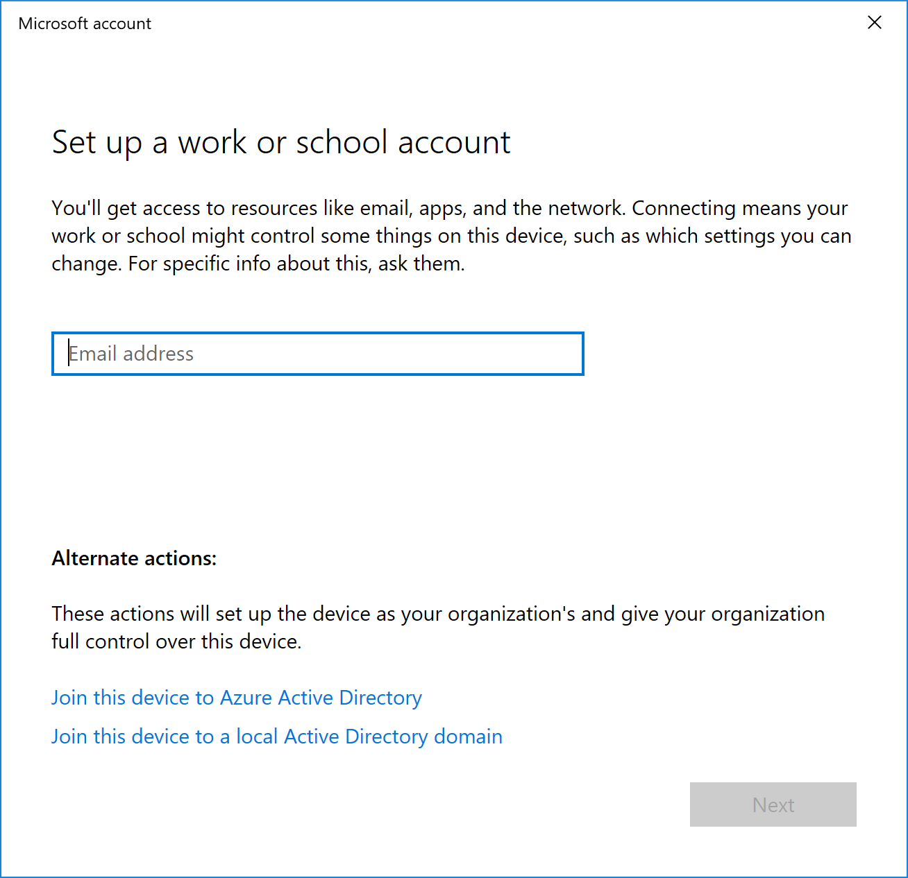
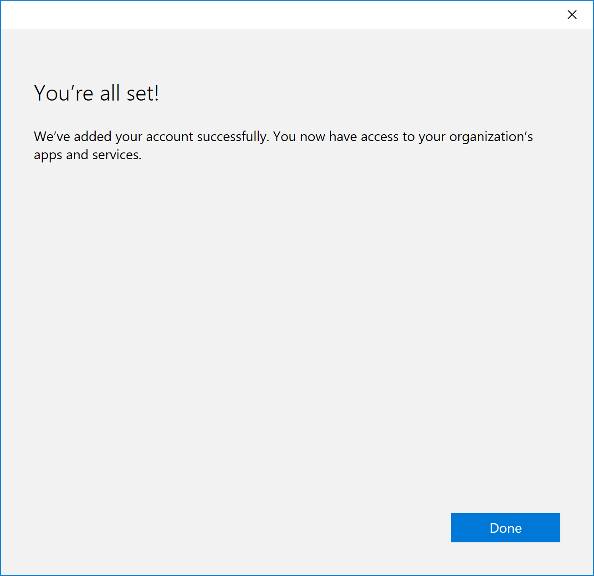
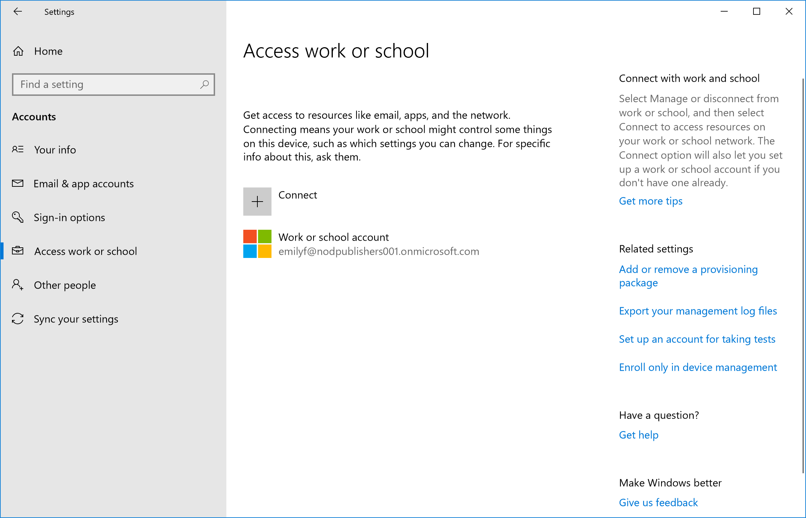

# Quickstart: Enroll your Windows 10 device

In this quickstart, you'll enroll your Windows 10 device into Microsoft Intune.

Enrolling your devices into Microsoft Intune allows your Windows 10 devices to get access to your organization’s secure data, including email, files, and other resources. This is true for both Windows 10 desktop and Windows 10 Mobile devices. Enrolling your devices helps secure this access for both you and your organization, and helps keep your work data separate from your personal data.

> [!TIP]
> Find out what happens when you [enroll your device in Intune](what-happens-if-you-install-the-company-portal-app-and-enroll-your-device-in-intune-windows.md) and what that means for the [information on your device](what-info-can-your-company-see-when-you-enroll-your-device-in-intune.md).

If you don’t have an Intune subscription, [sign up for a free trial account](free-trial-sign-up.md).

## Prerequisites

- Microsoft Intune subscription - [sign up for a free trial account](free-trial-sign-up.md)
- To complete this quickstart, you must complete the steps to [setup automatic enrollment in Intune](quickstart-setup-auto-enrollment.md).

## Sign in to Intune

Sign in to the [Intune](https://aka.ms/intuneportal) as a Global Administrator or an Intune Service Administrator.

## Windows 10 Desktop devices

1. Right-click the Windows **Start** icon and select **Settings** to display Windows Settings options.

   

2. Select **System** > **About**. 

   

    > [!TIP]
    > You can also type the phrase "About your PC" into the **search bar**, then select **About your PC**.

3. In the window you will see a list of Windows 10 for your PC. Within this list, locate the **Version**.

    > [!IMPORTANT]
    > The steps presented in this quickstart are for Windows 10 version **1607 or higher**, if your version is **1511 or less**, continue with [these steps](enroll-your-w10-device-your-account.md).

4. Return to Windows Settings and select **Accounts**.

   

5. Select **Access work or school** > **Connect**.

    

4. Sign in to Intune with your work or school account, and then select **Next**.

    > [!NOTE]
    > If you setting up an ".onmicrosoft.com", the user account will have **.onmicrosoft.com** as part of the account address. 

   

    You’ll see a message indicating that your company or school is registering your device.

6. When you see the **You’re all set!** screen, select **Close**. You’re done.

   

7. You will now see the added account as part of the **Access work or school** settings.

   

> [!TIP]
> If you followed the previous steps, but still can’t access your work or school email account and files, follow the steps in [Troubleshooting steps to follow if you see Access work or school](troubleshoot-your-windows-10-device-windows.md#troubleshooting-steps-to-follow-if-you-see-access-work-or-school).

## Clean up resources

To unenroll your Windows device, see [Remove your Windows device from management](unenroll-your-device-from-intune-windows.md).

## Next steps

In this quickstart, you learned how to enroll a Windows 10 device into Intune. You can learn about other ways to enroll devices across all platforms. For more information about device enrollment, see [What is device enrollment?](device-enrollment.md)

> [!div class="nextstepaction"]
> [Quickstart: Set a required password length for Android devices](quickstart-set-password-length-android.md)