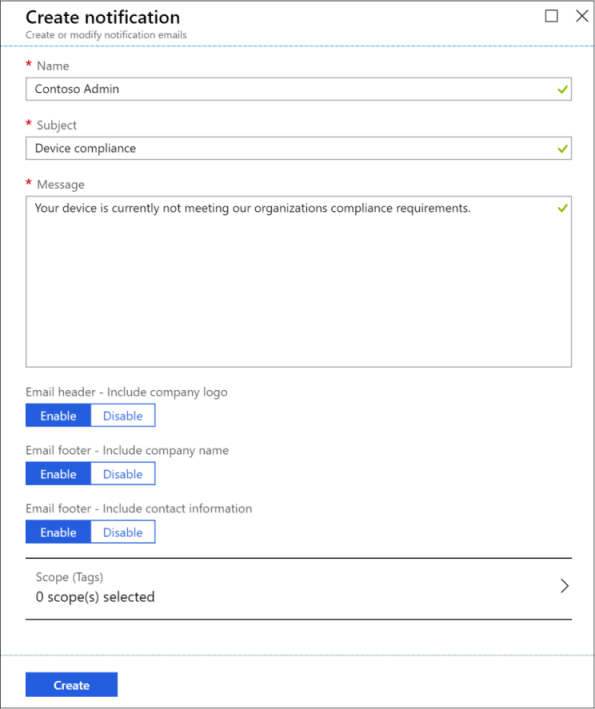
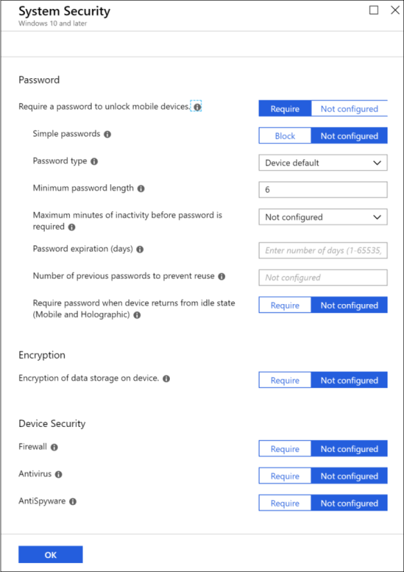

---
# required metadata

title: Quickstart - Send notifications to noncompliant devices
titleSuffix: Microsoft Intune
description: In this quickstart you will use Microsoft Intune to send email notifications to noncompliant devices.
keywords:
author: Erikre
ms.author: erikre
manager: dougeby
ms.date: 03/27/2019
ms.topic: quickstart
ms.service: microsoft-intune
ms.localizationpriority: high
ms.technology:
ms.assetid: a1b89f2d-7937-46bb-926b-b05f6fa9c749

# optional metadata

#ROBOTS:
#audience:
#ms.devlang:
ms.reviewer: joglocke
ms.suite: ems
search.appverid: MET150
#ms.tgt_pltfrm:
ms.custom: intune-azure
ms.collection: M365-identity-device-management
---

# Quickstart: Send notifications to noncompliant devices

In this quickstart, you will use Microsoft Intune to send an email notification to the members of your workforce that have noncompliant devices.

By default, when Intune detects a device that isn't compliant, Intune immediately marks the device as noncompliant. Azure Active Directory (AAD) [Conditional Access](https://docs.microsoft.com/azure/active-directory/active-directory-conditional-access-azure-portal) then blocks the device. When a device is not compliant, Intune allows you to add actions for noncompliance, which gives you flexibility to decide what to do. For example, you can give users a grace period to be compliant before blocking noncompliant devices.

One of the actions you can take when devices don't meet compliance is to send email to those end users. You can also customize an email notification before sending it to end users. Specifically, you can customize the recipients, subject, and message body, including company logo, and contact information. Intune will also include details about the noncompliant device in the email notification.

If you don’t have an Intune subscription, [sign up for a free trial account](free-trial-sign-up.md).

## Prerequisites
- When using device compliance policies to block devices from corporate resources, AAD Conditional Access must be set up. If you have completed the [Create a device compliance policy](quickstart-set-password-length-android.md) quickstart, you are using Azure Active Directory. For more information about AAD, see [Conditional Access in Azure Active Directory](https://docs.microsoft.com/azure/active-directory/active-directory-conditional-access-azure-portal) and [common ways to use Conditional Access with Intune](conditional-access-intune-common-ways-use.md).

## Sign in to Intune

Sign in to the [Intune](https://aka.ms/intuneportal) portal as a [Global administrator](users-add.md#types-of-administrators) or an Intune [Service administrator](users-add.md#types-of-administrators). If you have created an Intune Trial subscription, the account you created the subscription with is the Global administrator.

## Create a notification message template

To send email to your users, create a notification message template. When a device is noncompliant, the details you enter in the template is shown in the email sent to your users.

1. In Intune, select **Device compliance** > **Notifications** > **Create notification**. 
2. Enter the following information:

   - **Name**: *Contoso Admin*
   - **Subject**: *Device compliance*
   - **Message**: *Your device is currently not meeting our organization's compliance requirements.*
   - **Email header – Include company logo**: Set to **Enabled** to show your organization's logo.
   - **Email footer – Include company name**: Set to **Enabled** to show your organization's name.
   - **Email footer – Include contact information**: Set to **Enabled** to show your organization's contact information.

   

3. Once you're done adding the information, choose **Create**. The Notification message template is ready to use.

    > [!NOTE]
    > You can also edit a Notification template that was previously created.

For details about setting your company name, company contact information, and company logo, see [Company information and privacy statement](company-portal-app.md#company-information-and-privacy-statement), [Support information](company-portal-app.md#support-information), and [Company identity branding customization](company-portal-app.md#company-identity-branding-customization). 

## Add a noncompliance policy

When you create a device compliance policy, Intune automatically creates an action for noncompliance. When a device isn't meeting your compliance policy, Intune automatically marks the device as noncompliant. You can customize how long the device is marked as noncompliant. You can also add another action when you create a compliance policy, or update an existing compliance policy. 

The following steps will create a compliance policy for Windows 10 devices.

1. In Intune, select **Device compliance**.
2. Select **Policies** > **Create Policy**.
3. Enter the following information:

   - **Name**: *Windows 10 compliance*
   - **Description**: *Windows 10 compliance policy*
   - **Platform**: Windows 10 and later

4. Select **Settings** > **System Security** to display the device security-related settings.
5. Set **Require a password to unlock mobile devices** to **Require**. This setting specifies whether to require users to enter a password before access is granted to information on their mobile devices. 
6. Set **Minimum password length** to **6**. This setting specifies the minimum number of digits or characters in the password.

    

7. Select **OK** > **OK** > **Create** to create your compliance policy.
8. Select **Properties** > **Action for noncompliance** > **Add**.
9. In the **Action** drop-down box, confirm **Send email to end users** is selected.
10. Select **Message template** > **Contoso Admin** > **Select** to select the message template you created earlier in this topic.
11. Select **ADD** > **OK** > **Save** to save your changes.

## Assign the policy

You can assign the compliance policy to a specific group of users or to all users. When Intune recognizes that a device is noncompliant, the user will be notified that they must update their device to meet the compliance policy. The following steps allow you to assign the policy.

1. Select the **Windows 10 compliance** policy that you created earlier.
2. Select **Assignments**.
3. In the **Assign to** drop-down box, select **All Users**. This will select all users. Any user that has a **Windows 10 and later** device that doesn't meet this compliance policy will be notified.

    > [!NOTE]
    > You can include and exclude groups when assign compliancy policies.

4. Click **Save**.

When you've successfully created and saved the policy, it will appear in the list of **Device complice - Policies**. Notice in the list that **Assigned** is set to **Yes**.

## Next steps

In this quickstart, you used Intune to create and assign a compliance policy for your workforce's Windows 10 devices to require a password of at least six characters in length. For more information about creating compliance policies for Windows devices, see [Add a device compliance policy for Windows devices in Intune](compliance-policy-create-windows.md).

To follow this series of Intune quickstarts, continue to the next quickstart.

> [!div class="nextstepaction"]
> [Quickstart: Add and assign a client app](quickstart-add-assign-app.md)
