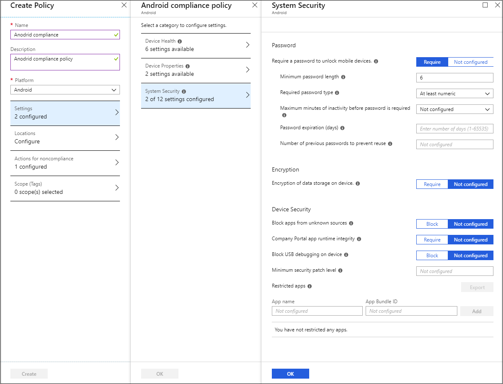

---
# required metadata

title: Quickstart - Set the required password length on Android devices
titlesuffix: Microsoft Intune
description: In this quickstart you will use Microsoft Intune to set the length of the password required for Android devices.
keywords:
author: Erikre
ms.author: erikre
manager: dougeby
ms.date: 10/17/2018
ms.topic: quickstart
ms.prod:
ms.service: microsoft-intune
ms.technology:
ms.assetid: 81b4fa08-5333-4c54-9f49-8db5f6984ed2

# optional metadata

#ROBOTS:
#audience:
#ms.devlang:
ms.reviewer:
ms.suite: ems
#ms.tgt_pltfrm:
ms.custom: intune-azure

---

# Quickstart: Set the required password length on Android devices

In this quickstart, you will use Microsoft Intune to require your workforce's Android users to enter a password of a specific length before access is granted to information on their Android devices. 

> [!IMPORTANT]
> In addition to password settings, you should also consider other system security settings to protect your workforce. For more information, see [System security settings](compliance-policy-create-android-for-work.md#system-security-settings).

If you don’t have an Intune subscription, [sign up for a free trial account](free-trial-sign-up.md).

## Prerequisites

- To complete this quickstart, you must first [create a user](quickstart-create-user.md) and [create a group](quickstart-create-group.md).

## Sign in to Intune

Sign in to the [Intune](https://aka.ms/intuneportal) as a Global Administrator or an Intune Service Administrator. Intune is located in the Azure portal by choosing **All services** > **Intune**. Intune is located in the **Monitoring + Management** section.

## Create a device compliance policy
1. Once you've opened the **Microsoft Intune** pane, select **Device compliance** > **Policies** > **Create Policy**.
2. Add **Android compliance** as the  **Name**. Also, add a **Description**.
3. For **Platform**, select **Android**. 
4. Select **Settings** > **System Security** to display the Android **System Security** blade.
5. In the **Password** section, next to **Require a password to unlock mobile devices** click **Require**.
6. Next to **Minimum password length**, enter **6**.  

    

7. When done, click **OK** to close the **System Security** blade. 
8. Click **OK** to close the **Android compliance policy** blade. 
9. Click **Create** to create the policy.

When you've successfully created the policy, it will appear in the list of **Device complice - Policies**. 

## Next steps

In this quickstart, you used Intune to create a compliance policy for your workforce's Android devices to require a password of at least six characters in length.

> [!div class="nextstepaction"]
> [Set up automatic enrollment](quickstart-setup-auto-enrollment.md)
