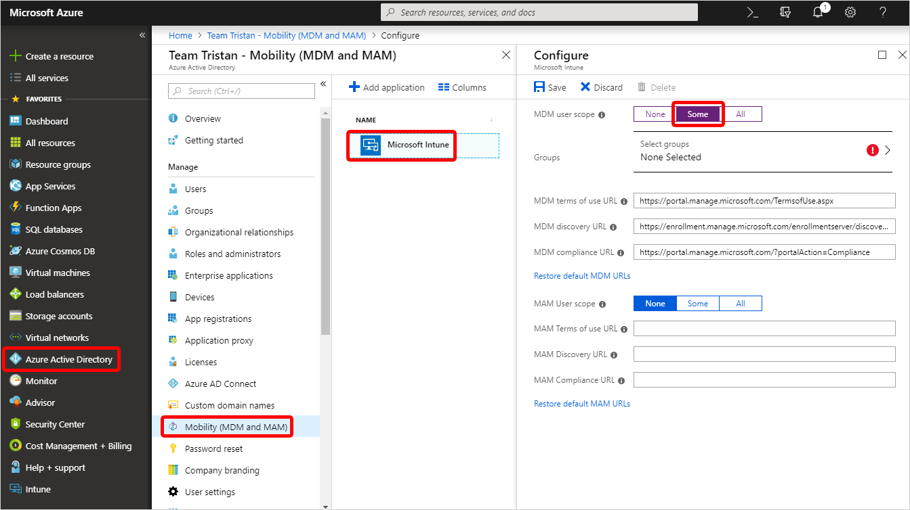

# Quickstart: Set up automatic enrollment for Windows 10 devices

In this quickstart, you'll set up Microsoft Intune to automatically enroll devices when specific users sign in to Windows 10 devices.

If you don’t have an Intune subscription, [sign up for a free trial account](free-trial-sign-up.md).

## Prerequisites

- [Create a group](get-started-groups.md) that contains the specific users that you want to automatically enroll.

## Sign in to Intune

Sign in to the [Intune](https://aka.ms/intuneportal) as a Global Administrator or an Intune Service Administrator.

## Set up Windows 10 automatic enrollment

For this example, you'll use MDM enrollment so that both corporate and bring-your-own-devices can be auto-enrolled.

1. In Azure, choose **Azure Active Directory** > **Mobility (MDM and MAM)** > **Microsoft Intune** > **Some**.

2. Choose **Select groups** > **TestGroup1** > **Select**.
3. Use the default values for the following URLs:
    - MDM terms of use URL
    - MDM discovery URL
    - MDM compliance URL
4. Choose **Save**.
5. Sign in as a user in the group on a Windows 10 device and follow the prompts.

## Clean up resources

To reconfigure Intune automatic enrollment, check out [Set up enrollment for Windows devices](windows-enroll.md).

## Next steps

Learn about other ways to enroll devices across all supported platforms in the [What is device enrollment? article](device-enrollment.md).