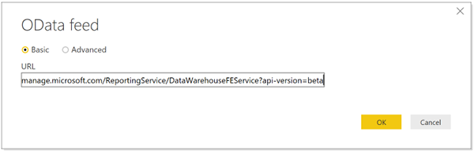
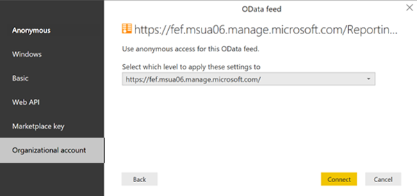

---
# required metadata
title: Create a report from the OData feed with Power BI | Microsoft Docs
description: Create a treemap visualization using Power BI Desktop with an interactive filter from the Intune Data Warehouse API.
keywords: Intune Data Warehouse
author: mattbriggs
ms.author: mabrigg
manager: angrobe
ms.date: 10/18/2017
ms.topic: article
ms.prod:
ms.service: microsoft-intune
ms.technology:
ms.assetid: A2C8A336-29D3-47DF-BB4A-62748339391D

# optional metadata
#ROBOTS:
#audience:
#ms.devlang:
ms.reviewer: jeffgilb
ms.suite: ems
#ms.tgt_pltfrm:
ms.custom: intune-classic
---

# Create a report from the OData feed with Power BI

In this tutorial, you're going to create a treemap visualization using Power BI Desktop with an interactive filter. For example, your CFO might like to how the overall distribution of devices compares to just company owned to personal devices. The treemap provides insight into the total number of device types. You can review the number of iOS, Android, and Windows devices that are either company owned or personally owned.

### Overview of creating the chart

To create this chart, you will:
1. Install Power BI Desktop if you don't already have it.
2. Connect to the Intune Data Warehouse data model and retrieve current data for the model.
3. Create or manage the data model relationships.
4. Create the chart with data from the **devices** table.
5. Create an interactive filter.
6. View the finished chart.

### A note about tables and entities

You work with tables in Power BI. A table contains data fields. Each data field has a data type. The field can only contain data of the data type. Data types are numbers, text, dates, and so on. The tables in Power BI fill with recent historical data from your tenant when you load the model. Although the specific data changes with time, the table structure won't change unless the underlying data model is updated.

You may be confused by the use of the term _entity_ and _table_. The data model is accessible through an OData feed. In the universe of the OData, the containers that are called tables in Power BI are called entities. These terms both refer to the same thing that holds your data.

## Install Power BI Desktop

Install the latest version of Power BI Desktop. You can download Power BI Desktop from: [PowerBI.microsoft.com](https://powerbi.microsoft.com/desktop)

## Connect to the OData feed for the Intune Data Warehouse for your tenant

> [!Note]  
> You need permission to **Reports** in Intune. For more information, see [Authorization](reports-api-url.md).

1. Sign in to the Azure portal.
2. Choose **More Services** > **Monitoring + Management** + **Intune**.
3. Open the **Intune Data Warehouse** blade.
4. Copy the custom feed URL. For example:
`https://fef.tenant.manage.microsoft.com/ReportingService/DataWarehouseFEService?api-version=beta`
5. Open Power BI Desktop.
6. Choose **Get Data** > **Odata feed**.
7. Paste the custom feed URL into the URL box in the **OData feed** window.
8. Select **Basic**.

    

9. Select **OK**.
10. Select **Organization account**, and then sign in with your Intune credentials. 

    

11. Select **Connect**. The Navigator will open and show you the list of tables in the Intune Data Warehouse. 

    

12. Select the **devices** and the **ownerTypes** tables.  Select **Load**. Power BI loads data to the model.

## Create a relationship 

You can import multiple tables to analyze not just the data in a single table but related data across tables.  PowerBI has a feature called **autodetect** that attempts to find and create relationships for you. The tables in the Data Warehouse have been built to work with PowerBI's autodetect feature. However, even if PowerBI doesn't automatically find the relationships you still manage the relationships.

1. Select **Manage Relationships**.
2. Select **Autodetect...** if PowerBI has not already detected the relationships.  
The relationship is displayed in a From column to a To column. In this example, the data field **ownerTypeKey** in the **devices** table links to the data field **ownerTypeKey** in the **ownerTypes** table. You use the relationship to look up plain name of the device type code in the **devices** table.

## Create a treemap visualization

A treemap chart shows hierarchical data as boxes with in boxes. Each branch of the hierarchy is a box contains smaller boxes showing subbranches. You can use Power BI desktop to create a treemap of your Intune data.

1. Select a chart type. Select **Treemap**.
2. In the data model, find the **devices** table.
3. Expand the **devices table** and select the **manufacturer** data field in the **Fields** panel.
4. Drag the **manufacturer** data field to the Treemap chart on the report canvas.
5. Drag the **deviceKey** data field from the **devices** table to the **Values** section under the **Visualizations** pane and drop on the box labeled **Drag data field here**.  
You now have a visual that shows us the distribution of manufacturers of devices within your organization.

## Add a filter

You can add a filter to your treemap so that you can answer additional questions using your app. 

1. Select the report canvas, and then select the **Slicer icon** (  ) under **Visualizations** to add a filter.
2. Find the **ownerTypes** table and drag the **ownerTypeName** data field under the **Filters** section in the **Visualizations** panel.  
   Under the devices table, there's a data field called **OwnerTypeKey** that contains a code as to whether a device is company-owned or personal. Since you would like to show friendly names in this filter, look for the **ownerTypes** table and drag the **ownerTypeName**. This is an example of how the data model supports relationships between tables.

You now have an interactive filter that can be used to toggle between company owned and personally owned devices to see how the distribution changes.

1. Select **Company** to see that the company owned device distribution.
2. Select **Personal** to see the personally owned devices.

## Next steps

 - Learn more about [creating and managing relationships](https://powerbi.microsoft.com/documentation/powerbi-desktop-create-and-manage-relationships/) in the Power BI Desktop in the Power BI documentation.
 - Consult the [Intune Data Warehouse Model](https://docs.microsoft.com/intune/reports-ref-data-model).