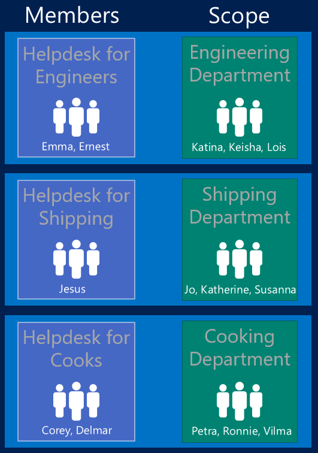

---
# required metadata

title: RBAC with Intune
titleSuffix: "Azure portal"
description: "Intune Azure preview: Learn how RBAC lets you control who can perform actions and make changes."
keywords:
author: arob98
ms.author: angrobe
manager: dougeby
ms.date: 02/27/2018
ms.topic: get-started-article
ms.prod:
ms.service: microsoft-intune
ms.technology:
ms.assetid: ca3de752-3caa-46a4-b4ed-ee9012ccae8e

# optional metadata

#ROBOTS:
#audience:
#ms.devlang:
ms.reviewer: 
ms.suite: ems
#ms.tgt_pltfrm:
ms.custom: intune-azure

---

# Role-based administration control (RBAC) with Intune

RBAC helps you control who can perform various Intune tasks within your organization, and who those tasks apply to. You can either use the built-in roles that cover some common Intune scenarios, or you can create your own roles. A role is defined by:

- **Role definition**: The name of a role, the resources it manages, and the permissions granted for each resource.
- **Members**: The user groups that are granted the permissions.
- **Scope**: The user or device groups that the members can manage.
- **Assignment**: When the definition, members, and scope have been configured, the role is assigned.

Starting at the new Azure portal, **Azure Active Directory (Azure AD)** provides two Directory Roles which can be used with Intune. These roles are granted full permission to perform all activities in Intune:

- **Global Administrator:** Users with this role have access to all administrative features in Azure AD, as well as services that federate to Azure AD like Exchange Online, SharePoint Online, and Skype for Business Online. The person who signs up for the Azure AD tenant becomes a global administrator. Only global administrators can assign other Azure AD administrator roles. There can be more than one global administrator at your organization. Global admins can reset the password for any user and all other administrators.

- **Intune Service Administrator:** Users with this role have global permissions within Intune when the service is present. Additionally, other than any superseding Azure restrictions, this role provides the ability to manage users, devices, and create and manage Intune groups.

- **Conditional Access Administrator:** Users with this role only have permissions to view, create, modify, and delete conditional access policies.

	> [!IMPORTANT]
	> The Intune Service Administrator role does not provide the ability to manage Azure AD’s conditional access settings.

	> [!TIP]
	> Intune also shows three Azure AD extensions: **Users**, **Groups**, and **Conditional access**, which are controlled using Azure AD RBAC. Additionally, the **User Account Administrator** only performs AAD user/group activities and does not have full permissions to perform all activities in Intune. Refer to [RBAC with Azure AD](https://docs.microsoft.com/azure/active-directory/active-directory-assign-admin-roles) for more details.

## Roles created in the Intune classic portal

Only Intune **Service Administrators** users with "Full" permissions get migrated from the Intune classic portal to Intune in the Azure portal. You need to re-assign Intune **Service Administrators** users with "Read-Only" or "Helpdesk" access into the Intune roles in the Azure portal, and remove them from the classic portal.

> [!IMPORTANT]
> You might need to keep the Intune Service Administrator access in the classic portal if your admins still need access to manage PC’s using with Intune.

## Built-in roles

The following roles are built into Intune and you can assign them to groups with no further configuration:

- **Help Desk Operator**: Performs remote tasks on users and devices, and can assign applications or policies to users or devices.
- **Policy and Profile Manager**: Manages compliance policy, configuration profiles, Apple enrollment, and corporate device identifiers.
- **Read Only Operator**: Views user, device, enrollment, configuration, and application information. Cannot make changes to Intune.
- **Application Manager**: Manages mobile and managed applications, and can read device information.
- **School Administrator**: Manages Windows 10 devices in [Intune for Education](introduction-intune-education.md), and can take the following actions: 

|Permission|Operation|
|---|---|
|Audit Data|Read|
|DeviceConfigurations|Assign, Create, Delete, Read, Update|
|Device Enrollment Managers|Read, Update|
|Managed Devices|Read, Update<!--, Delete [To be added in 1803]-->|
|Mobile apps|Assign, Create, Delete, Read, Update|
|Reports|Read|
|Remote Actions|Clean PC, Reboot, Remote Lock, Retire, Sync Devices, Wipe|
|Organization|Read|

### To assign a built-in role

1. Sign into the [Azure portal](https://portal.azure.com).
2. Choose **All services** > **Intune**. Intune is located in the **Monitoring + Management** section.
3. On the **Intune** pane, choose **Intune roles**, then select **All roles**.
1. On the **Intune roles - All roles** pane, choose the built-in role you want to assign.

2. On the <*role name*> - **Overview** pane, choose **Manage**, then **Assignments**.

	> [!NOTE]
	> You cannot delete or edit the built-in roles

3. On the custom role pane, choose **Assign**.

4. On the **Role Assignments** pane, enter a **Name** and optional **Description** for the assignment, and then choose the following:
	- **Members** - Select a group that contains the user you want to give the permissions to.
	- **Scope** - Select a group containing the users who the member above will be allowed to manage.
  
5. When you are done, click **OK**. The new assignment is displayed in the list of assignments.

### Intune RBAC table

- Download the [Intune RBAC table](https://gallery.technet.microsoft.com/Intune-RBAC-table-2e3c9a1a) to see more details on what each role can do.

## Custom roles

You can create a custom role that includes any permissions required for a specific job function. For example, if an IT department group manages applications, policies, and configuration profiles, you can add all those permissions together in one custom role.

> [!IMPORTANT]
> To create, edit, or assign roles, your account must have one of the following permissions in Azure AD:
> - **Global Administrator**
> - **Intune Service Administrator**

### To create a custom role

1. Sign into the [Azure portal](https://portal.azure.com) with your Intune credentials.

2. Choose **All services** from the left menu, then type **Intune** in the text box filter.

3. Choose **Intune**, the Intune Dashboard opens, choose **Intune roles**.

4. On the **Intune roles** pane, choose **All roles**, choose **Add custom**.

5. On the **Add Custom Role** pane, enter a name and description for the new role, then click **Permissions**.

3. On the **Permissions** pane, choose the permissions you want to use with this role. Use the [Intune RBAC table](https://gallery.technet.microsoft.com/Intune-RBAC-table-2e3c9a1a) to help you decide which permissions you want to apply.

4. When you are done, choose **OK**.

5. On the **Add Custom Role** pane, click **Create**. The new role is displayed in the list on the **Intune roles - All roles** pane.

### To assign a custom role

1. On the **Intune roles - All roles** pane, choose the custom role you want to assign.

2. On the <*role name*> - **Overview** pane, choose **Manage**, then **Assignments**. On this pane, you can also edit or delete existing roles.

3. On the custom role pane, choose **Assign**.

4. On the **Role Assignments** pane, enter a **Name** and optional **Description** for the assignment, and then choose the following:
	- **Members** - Select a group that contains the user you want to give the permissions to.
	- **Scope** - Select a group containing the users who the member above will be allowed to manage.
  
5. When you are done, click **OK**. The new assignment is displayed in the list of assignments.

## Next steps

[Use the Intune Helpdesk operator role with the troubleshooting portal](help-desk-operators.md)

## See also

[Assign roles using Azure AD](https://docs.microsoft.com/azure/active-directory/active-directory-users-assign-role-azure-portal)
