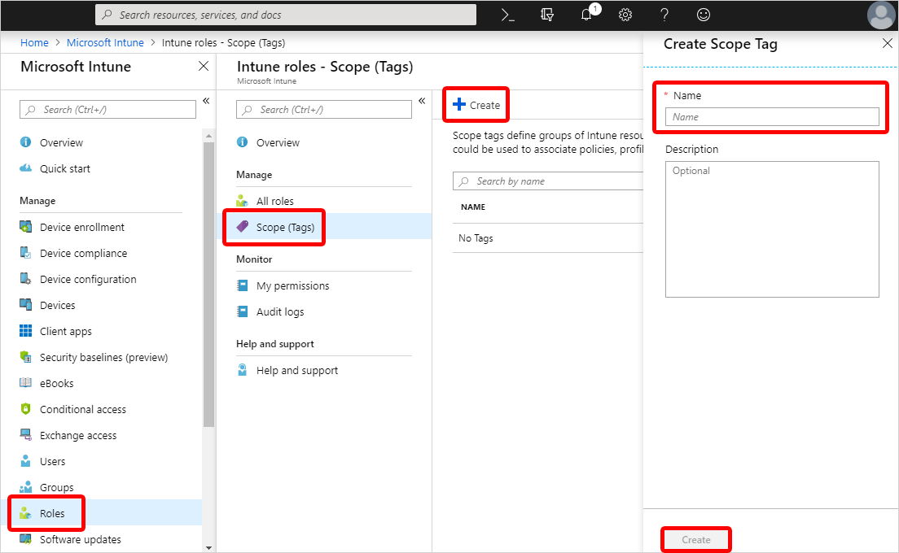
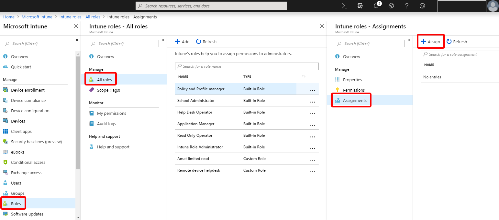

---
# required metadata

title: Filter policies with scope tags in Microsoft Intune - Azure | Microsoft Docs
description: Use scope tags to filter configuration profiles to specific roles.
keywords:
author: ErikjeMS
ms.author: erikje
manager: dougeby
ms.date: 03/08/2019
ms.topic: article
ms.service: microsoft-intune
ms.technology:
ms.assetid: 

# optional metadata

#ROBOTS:
#audience:
#ms.devlang:
#ms.reviewer:
ms.suite: ems
search.appverid: MET150
#ms.tgt_pltfrm:
ms.custom: intune-azure
ms.collection: M365-identity-device-management
---

# Use role-based access control (RBAC) and scope tags for distributed IT

You can use role-based access control and scope tags to make sure that the right admins have the right access and visibility to the right Intune objects. Roles determine what access admins have to which objects. Scope tags determine which objects admins can see.

For example, let’s say that a Seattle regional office admin is assigned the Policy and Profile Manager role. You want this admin to see and manage only the profiles and policies that only apply to Seattle devices. To do this, you would:

1. Create a scope tag called Seattle.
2. Create a role assignment for the Policy and Profile Manager role with: 
    - Members (Groups) = A security group named Seattle IT admins. All admins in this group will have  permission to manage policies and profiles for users/devices in the Scope (Groups).
    - Scope (Groups) = A security group named Seattle users. All users/devices in this group can have their profiles and policies managed by the admins in the Members (Groups). 
    - Scope (Tags) = Seattle. Admins in the Member (Groups) can see devices that also have the Seattle scope tag.
3. Add the Seattle scope tag to policies and profiles that you want admins in Members (Groups) to be able to access.
4. Add the Seattle scope tag to devices that you want visible to admins in the Members (Groups). 

## To create a scope tag

1. In Intune, choose **Roles** > **Scope (Tags)** > **Create**.

    

3. If you want all devices in specific groups, choose **Assign scope tag to all devices in selected groups**.
    1. In the **Select groups to include** page, choose the groups containing the devices that you want to assign this scope tag to.
    2. Choose **Select**.
4. Choose **Create**.

## To assign a scope tag to a role

1. In Intune, choose **Roles** > **All roles** > choose a role > **Assignments** > **Assign**.

    

2. Provide an **Assignment name** and **Description**.
3. Choose **Members (Groups)** > **Add** > choose the groups that you want as part of this assignment > **Select** > **OK**. mUsers in this group will have permissions to manage policies and profiles for users/devices in the Scope (Groups).

    

4. If you want to manage users/devices in a specific set of groups, choose **Scope (Groups)** > **Selected Groups** > **Select groups to include** > choose the groups > **Select** > **OK**. All users/devices in this group can have their profiles and policies managed by the admins in the Members (Group).

    

    Alternately, you can choose **All Devices**, **All Users**, or **All Users & All Devices**.

    
    
5. Choose **Scope (Tags)** > **Add** > choose the tags that you want to add to this role > **Select** > **OK**. Users in Members (Groups) will have access to the policies and profiles that also have the same scope tag.

    

6. Choose **OK**. 

## To add a scope tag to a configuration profile
1. In Intune, choose **Device configuration** > **Profiles** > choose a profile.

    

2. Choose **Properties** > **Scope (Tags)** > **Add**.

    

3. Under **Select Tags**, choose the tags that you want to add to the profile.
4. Choose **Select** > **OK** > **Save**.

## To assign a scope tag to an app configuration policy
For devices with **Device enrollment type** set to **Managed devices**:
1. Choose **Client apps** > **App configuration policies** > choose an app configuration policy.
2. Choose **Properties** > **Scope (Tags)** > choose the tags you want to assign to the policy.

For devices with **Device enrollment type** set to **Managed apps**:
1. Choose **Client apps** > **App configuration policies** > choose an app configuration policy.
2. Choose **Scope (Tags)** > choose the tags you want to assign to the policy.

## To assign a scope tag to an iOS app provisioning profile
1. In Intune, choose **Client apps** > **iOS app provisioning profiles** > choose a profile.
2. Choose **Properties** > **Scope (Tags)** > choose the tags that you want to assign to the profile.
3. Choose **Select** > **OK** > **Save**.

## To assign a scope tag to an Apple Volume Purchase Program (VPP) token
1. In Intune, choose **Client apps** > **Apple VPP tokens** > choose a VPP token.
2. Select **Scope (Tags)** > choose the tags that you want to assign to the profile. The VPP apps and ebooks associated with the VPP token inherit the assigned tags.
3. Choose **Select** > **OK** > **Save**.

## Scope tag details
When working with scope tags, remember these details:

- You can currently assign scope tags to:
  - Role assignments
  - Device compliance policies
  - Device configuration profiles
  - Windows 10 updates rings
  - Managed devices
  - Apps
  - App configuration policies – managed devices
  - Powershell scripts
  - DEP tokens
  - iOS app provisioning profile
  - Volume Purchase Program (VPP) tokens
- When an admin creates an object in Intune, all scope tags assigned to that admin will be automatically assigned to the new object.
- Intune RBAC doesn't apply to Azure Active Directory roles. So, the Intune Service Admins and Global Admins roles have full admin access to Intune no matter what scope tags they have.
- Administrators in a role assignment with scope tags can also see Intune objects with no scope tags.
- You can only assign a scope tag that you have in your role assignments.
- You can only target groups that are listed in the Scope (Groups) of your role assignment.
- If you have a scope tag assigned to your role, you can't delete all scope tags on an Intune object. At least one scope tag is required.

## Next steps

Manage your [roles](role-based-access-control.md) and [profiles](device-profile-assign.md).
