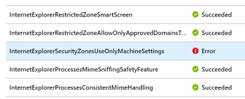
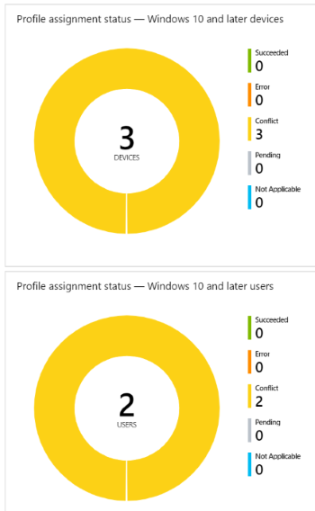
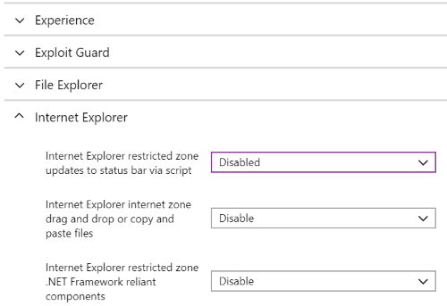
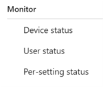

---
# required metadata

title: Check the success or failure of security baselines in Microsoft Intune - Azure | Microsoft Docs
description: Check the error, conflict and success status when deploying security baselines to users and devices in Microsoft Intune MDM. See how to troubleshoot using client logs, and the report features in Intune.
keywords:
author: MandiOhlinger 
ms.author: mandia
manager: dougeby
ms.date: 01/22/2019
ms.topic: article
ms.prod:
ms.service: microsoft-intune
ms.technology:
ms.assetid: 

# optional metadata

#ROBOTS:
#audience:
#ms.devlang:
ms.reviewer: joglocke
ms.suite: ems
#ms.tgt_pltfrm:
ms.custom: intune-azure

---

# Monitor the security baseline and profile in Microsoft Intune

There are different monitoring options when using security baselines. You can monitor the security baselines profile that applies to your users and devices. You can also monitor the actual baseline, and any devices that match (or don't match) the recommended values.

This article walks you through both monitoring options.

[Security baselines in Intune](security-baselines.md) provides more details on the security baselines feature in Microsoft Intune.

## Monitor the baseline and your devices

When you monitor the baseline, you get insight into the security state of your devices based on Microsoft's recommendations.

> [!NOTE]
> After a baseline is first assigned, reports may take up to 24 hours to update. After that, they may take up to 6 hours to update.

1. In the [Azure portal](https://portal.azure.com/), select **All services** > filter on **Intune** > select **Intune**.
2. Select **Security Baselines (preview)** > select a baseline.
3. In **Overview**, the graph shows how many devices are impacted by the baseline you chose, and the different statuses:

    

    The following statuses are available:

    - **Matches baseline**: All the settings in the baseline match the recommended settings.
    - **Does not match baseline**: At least one setting in the baseline doesn't match the recommended settings.
    - **Misconfigured**: At least one setting isn't properly configured. This status means the setting is in a conflict, error, or a pending state.
    - **Not applicable**: At least one setting isn't applicable, and isn't applied.

4. Select one of the statuses that has devices. For example, select the **Misconfigured** status.

5. A list of all the devices with that status is shown. Select a specific device to get more details. 

    In the following example, select **Device configuration** > Select the profile with an Error state:

    

    Select the Error profile. A list of all settings in the profile, and their state is shown. Now, you can scroll to find the setting causing the error:

    

Use this reporting to see any settings in a profile that are causing an issue. Also get more details of policies and profiles deployed to devices.

> [!NOTE]
> When a property is set to **Not configured** in the baseline, the setting is ignored, and no restrictions are enforced. The property isn't shown in any reporting.

## Monitor the profile

Monitoring the profile gives you insight into the deployment state of your devices, but not the security state based on the baseline recommendations.

1. In Intune, select **Security Baselines** > select a baseline > **Profiles created**.

2. Select a profile. In **Overview**, the image shows how many devices and users have this profile assigned:

    

3. Under **Manage** > **Properties**, a list of all the settings in the baseline are shown. You can also change any of these settings:

    

4. In **Monitor**, you can see the deployment status of the profile on individual devices, the status for each user, and the status for each setting in the baseline:

    

## Troubleshoot using per-setting status

You deployed a security baseline, but the deployment status shows an error. The following steps give you some guidance on troubleshooting the error.

1. In Intune, select **Security Baselines** > select a baseline > **Profiles created**.
2. Select a profile > Under **Monitor** > **Per-setting status**.
3. The table shows all the settings, and the status of each setting. Select the **Error** column or the **Conflict** column to see the setting causing the error.

### MDM diagnostic information

At this point, you know the problematic setting. The goal is to find out why this setting is causing an error or conflict. 

On Windows 10 devices, there's a built-in MDM diagnostic information report. This report includes default values, current values, lists the policy, shows if it's deployed to the device or the user, and more. Use this report to help determine see why the setting is causing a conflict or error.

1. On the device, go to **Settings** > **Accounts** > **Access work or school**.
2. Select the account > **Info** > **Advanced Diagnostic Report** > **Create report**.
3. Choose **Export**, and open the generated file.
4. In the report, look for the error or conflict setting in the different sections of the report.

  For example, look in the **Enrolled configuration sources and target resources** section or the **Unmanaged policies** section. You may get an idea of why it's causing an error or conflict.

[Diagnose MDM failures in Windows 10](https://docs.microsoft.com/windows/client-management/mdm/diagnose-mdm-failures-in-windows-10) provides more information on this built-in report.

> [!TIP]
> - Some settings also list the GUID. You can search for this GUID in the local registry (regedit) for any set values.
> - The Event Viewer logs may also include some error information on the problematic setting (**Event viewer** > **Applications and Services Logs** > **Microsoft** > **Windows** > **DeviceManagement-Enterprise-Diagnostics-Provider** > **Admin**).

## Next steps

[Monitor device profiles](device-profile-monitor.md) and [see some common issues and resolutions](device-profile-troubleshoot.md).
