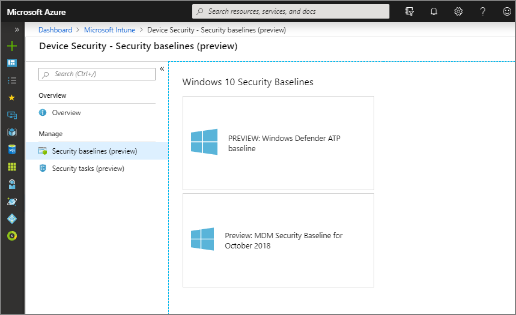
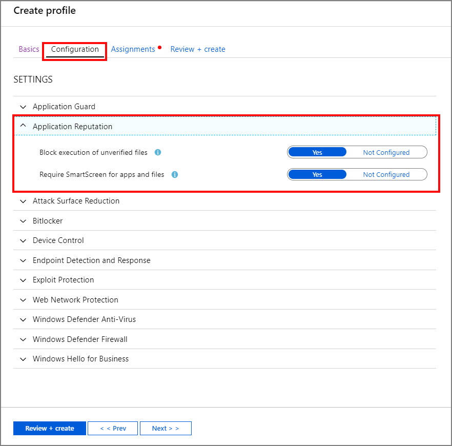
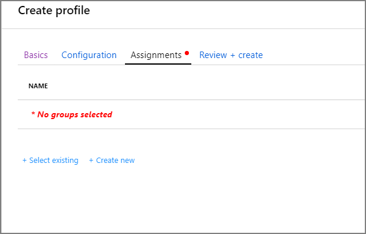
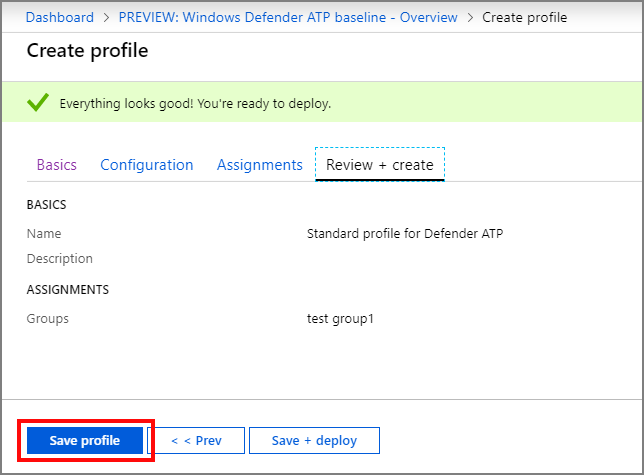

---
# required metadata

title: Use security baselines in Microsoft Intune - Azure | Microsoft Docs
description: Add or configure recommended group security settings to protect user and data on devices using Microsoft Intune for mobile device management. Enable BitLocker, configure Microsoft Defender Advanced Threat Protection, control Internet Explorer, use Smart Screen, set local security policies, require a password, block internet downloads, and more.
keywords:
author: brenduns 
ms.author: brenduns
manager: dougeby
ms.date: 05/29/2019
ms.topic: conceptual
ms.service: microsoft-intune
ms.localizationpriority: high
ms.technology:
ms.assetid: 

# optional metadata

#ROBOTS:
#audience:
#ms.devlang:
ms.reviewer: joglocke
ms.suite: ems
#ms.tgt_pltfrm:
ms.custom: intune-azure
ms.collection: M365-identity-device-management
---

# Create a Windows 10 security baseline in Intune

Security baselines is a feature in preview that's available for devices running Windows 10 and later. This feature includes many settings supported by Intune that you can use to help secure and protect your users and devices. It also automatically sets these settings to values recommended by security teams. For example, the baseline automatically enables BitLocker, automatically requires a password to unlock a device, automatically disables basic authentication, and more.

This feature applies to:

- Windows 10 version 1809 and later

> [!NOTE]
> While security baselines is in preview, Microsoft doesn't recommend using profiles in a production environment, as the baselines may change over the course of the preview. When security baselines are generally available, existing profiles won't convert to the latest supported profiles.

The goal of using security baselines is to provide an end-to-end secure workflow when working with Microsoft 365. Some of the benefits include:

- A security baseline includes the best practices and recommendations on settings that impact security. Intune partners with the same Windows security team that creates group policy security baselines. These recommendations are based on guidance and extensive experience.
- If you're brand new to Intune, and not sure where to start, then security baselines gives you an advantage. You can quickly create and deploy a secure profile, knowing that you're helping protect your organization's resources and data.
- If you currently use group policy, migrating to Intune for management is much easier with these baselines. These baselines are natively built in to Intune, and include a modern management experience.

Security baselines create a "configuration profile" in Intune. This profile includes all the settings in the baseline. You then apply or assign this profile to your users, groups, and devices.

After the profile is assigned, you can monitor the profile, and monitor the baseline. For example, you can see which devices match the baseline, or don't match the baseline.

This article can help you use security baselines to create a profile, assign the profile, and monitor the profile.

[Windows security baselines](https://docs.microsoft.com/windows/security/threat-protection/windows-security-baselines) is a great resource to learn more about this feature. [Mobile device management](https://docs.microsoft.com/windows/client-management/mdm/) (MDM) is a great resource about MDM, and what you can do on Windows devices.

## Available security baselines  

The following security baselines are available for use with Intune.
- **Preview: MDM Security Baseline for October 2018**  
  [View the settings](security-baseline-settings-windows.md)

- **PREVIEW: Windows Defender ATP baseline**  
  [View the settings](security-baseline-settings-defender-atp.md)  
  *(This baseline is available when your environment meets the prerequisites for using [Microsoft Defender Advanced Threat Protection](advanced-threat-protection.md#prerequisites))*.

## Prerequisites
To manage baselines in Intune, your account must have the [Policy and Profile Manager](role-based-access-control.md#built-in-roles) built-in role.

## Co-managed devices

Security baselines on Intune-managed devices are similar to co-managed devices with Configuration Manager. Co-managed devices use System Center Configuration Manager and Microsoft Intune to manage the Windows 10 devices simultaneously. It lets you cloud-attach your existing Configuration Manager investment to the benefits of Intune. [Co-management overview](https://docs.microsoft.com/sccm/comanage/overview) is a great resource if you use Configuration Manager, and also want the benefits of the cloud.

When using co-managed devices, you must switch the **Device configuration** workload (its settings) to Intune. [Device configuration workloads](https://docs.microsoft.com/sccm/comanage/workloads#device-configuration) provides more information.

## Create the profile

1. Sign in to [Intune](https://go.microsoft.com/fwlink/?linkid=2090973) and then select **Device security** > **Security baselines (preview)**. A list of the available baselines is available. 

    

   >[!TIP]  
   > The Windows Defender ATP baseline is available when your environment meets the prerequisites for using [Microsoft Defender Advanced Threat Protection](advanced-threat-protection.md#prerequisites).
2. Select the baseline you'd like to use, and then select **Create profile**.  

3. On the **Basics** tab, specify the following properties:

    - **Name**: Enter a name for your security baselines profile. For example, enter *Standard profile for Defender ATP*
    - **Description**: Enter some text that describes what this baseline does. The description is for you to enter any text you want. It's optional, but definitely recommended.

4. Select the **Configuration** tab to view the available groups of **Settings** in this baseline. Select a group to expand it and view the individual settings it contains. The settings have default configurations for the security baseline. Reconfigure the defaults settings to meet your business needs.  

    

5. Select the **Assignments** tab to assign the baseline to groups. Assign the baseline to an existing group, or create a new group using the standard process in the Intune console to complete your configuration.  

   
  
6. When you're ready to deploy the baseline, select the **Review + create** tab to review the details for the baseline. Then, select **Save profile** to save, and deploy the profile. 

    

   As soon as you save, the profile is pushed to devices when they check in with Intune. So, it can happen immediately.

   > [!TIP]  
   > You can save a profile without first assigning it to groups. You can edit the profile at a later time to add groups. 

7. After you create the profile, you can edit it by going to **Device security** > **Security baselines**, select the baseline you configured, and then select **Profiles**.  Select the profile and then select **Properties** to edit settings, and select **Assignments** to edit the groups that receive this baseline. 

## Q & A

#### Why these settings?

The Microsoft security team has years of experience working directly with Windows developers and the security community to create these recommendations. The settings in this baseline are considered the most relevant security-related configuration options. In each new build of Windows, the team adjusts its recommendations based on newly released features.

#### Is there a difference in the recommendations for Windows security baselines for group policy vs. Intune?

The same Microsoft security team chose and organized the settings for each baseline. Intune includes all the relevant settings in the Intune security baseline. There are some settings in the group policy baseline that are specific to an on-premises domain controller. These settings are excluded from Intune's recommendations. All the other settings are the same.

#### Are the Intune security baselines CIS or NSIT compliant?

Strictly speaking, no. The Microsoft security team consults organizations, such as CIS, to compile its recommendations. But, there isn't a one-to-one mapping between “CIS-compliant” and Microsoft baselines.

#### What certifications does Microsoft’s security baselines have? 

- Microsoft continues to publish security baselines for group policies (GPOs) and the [Security Compliance Toolkit](https://docs.microsoft.com/windows/security/threat-protection/security-compliance-toolkit-10), as it has for many years. These baselines are used by many organizations. The recommendations in these baselines are from the Microsoft security team’s engagement with enterprise customers and external agencies, including the Department of Defense (DoD), National Institute of Standards and Technology (NIST), and more. We share our recommendations and baselines with these organizations. These organizations also have their own recommendations that closely mirror Microsoft's recommendations. As mobile device management (MDM) continues to grow into the cloud, Microsoft created equivalent MDM recommendations of these group policy baselines. These additional baselines are built in to Microsoft Intune, and include compliance reports on users, groups, and devices that follow (or don't follow) the baseline.

- Many customers are using the Intune baseline recommendations as a starting point, and then customizing it to meet their IT and security demands. Microsoft’s Windows 10 RS5 **MDM Security Baseline** is the first baseline to release. This baseline is built as a generic infrastructure that allows customers to eventually import other security baselines based on CIS, NIST, and other standards. Currently, it's available for Windows and will eventually include iOS and Android.

- Migrating from on-premises Active Directory group policies to a pure cloud solution using Azure Active Directory (AD) with Microsoft Intune is a journey. To help, there are companion GPOs published for hybrid AD and Azure AD-joined devices. These devices can get MDM settings from the cloud (Intune) and group policy settings from on-premises domain controllers as needed.

## Next steps
- View the [Windows security baseline settings](security-baseline-settings-windows.md) supported by Intune.  
- Check the status and monitor the [baseline and profile](security-baselines-monitor.md).
