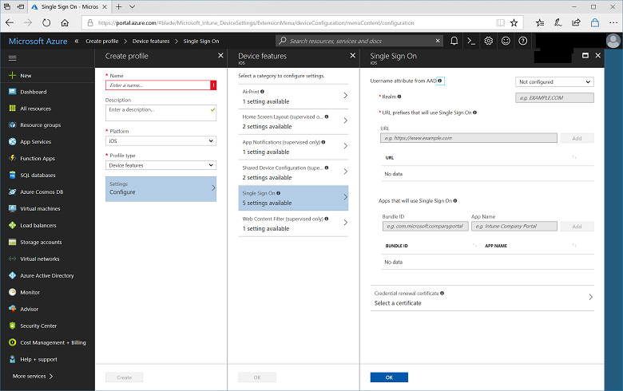

---
# required metadata

title: Configure Intune for iOS device single sign-on
titlesuffix: "Azure portal"
description: Learn how to configure Intune for iOS device single sign-on."
keywords:
author: vhorne
ms.author: victorh
manager: dougeby
ms.date: 12/7/2017
ms.topic: article
ms.prod:
ms.service: microsoft-intune
ms.technology:

# optional metadata

#ROBOTS:
#audience:
#ms.devlang:
ms.suite: ems
#ms.tgt_pltfrm:
ms.custom: intune-azure

---

# Configure Intune for iOS device single sign-on

[!INCLUDE[azure_portal](./includes/azure_portal.md)]

Most Line of Business (LOB) apps require some level of user authentication to support security. In many cases this requires the user to type the same credentials multiple times, which can be frustrating for users. To improve the user experience, developers can create apps that use single sign-on, reducing the number of times a user must provide credentials.

To take advantage of iOS device Single Sign-on, you must have the following conditions:

- An app coded to look for the user credential store in the single sign-on payload on the iOS device.
- Intune configured for iOS device single sign-on.

## To configure Intune for iOS device single sign-on

1. Sign into the [Azure portal](https://portal.azure.com).
2. Choose **More Services** > **Monitoring + Management** > **Intune**.
3. On the **Intune** blade, choose **Device configuration**.
2. On the **Device configuration** blade, choose **Profiles**.
3. On the profiles blade, choose **Create Profile**, provide a name and description, and configure the following settings:
   - **Platform**: Choose **iOS**. 
   - **Profile type**: Choose **Device features**.
4. On the **Device features** blade, choose **Single Sign On**.

   

2. Use the following summary table to help you fill in the fields on the **Single Sign On** blade. For details, see the sections after the table.
   
   |Field  |Notes|
   |---------|---------|
   |**Username attribute from AAD**|The attribute that Intune looks at for each user in AAD and populates the respective field (such as UPN) before generating the XML payload that gets installed on the device.|
   |**Realm**|The domain portion of the URL.|
   |**URL prefixes that will use Single Sign On**|Any URLs in your organization that require user single sign-on authentication|
   |**Apps that will use Single Sign On**|Apps on end user’s device that use the single sign-on payload.|
   |**Credential renewal certificate**|If using certificates for authentication, select the SCEP or PFX certificate that is deployed to the user as the authentication certificate.|

The following sections provide more details about each of the single sign-on fields.

### Username attribute from AAD and Realm

- If **User Principle Name** is selected for this field, it is parsed in the following way:

   

   You also have the choice to overwrite the realm with the text you type in the **Realm** text box.

   For example, Contoso might have several subregions such as Europe, Asia, and North America. They might want their users in Asia to use the SSO payload, and the app requires the UPN in the form *username@asia.contoso.com*. In this case, if you select **User Principle Name**, by default the realm for each user is taken from AAD that may be just *contoso.com*. So for users in Asia specially, you can create this payload and overwrite the realm with the value *asia.contoso.com*. Now the end user's UPN becomes *username@asia.contoso.com* and not *username@contoso.com*.

- If you select **Device ID**, Intune automatically selects the Intune Device ID.

   By default, apps only need to use the device ID. But if your app uses the realm in addition to the device ID, you can type the realm in the **Realm** text box.

   > [!NOTE]
   > By default keep the realm empty if you use device ID.

### URL prefixes that will use Single Sign On

Type any URLs here that exist in your organization that require user authentication.

For example, when a user connects to any of these sites, the iOS device uses the single sign-on credentials and the user does not need to enter any additional credentials. However, if you have multi-factor authentication enabled, users are required to enter the second authentication.

> [!NOTE]
> These URLs must be properly formatted FQDN. Apple requires these to be in the form `http://<yourURL.domain>`

The URL matching patterns must begin with either `http://` or `https://`. A simple string match is performed, so the URL prefix `http://www.contoso.com/` does not match `http://www.contoso.com:80/`. With iOS 9.0 or later, however, a single wildcard * may be used to specify all matching values. For example, `http://*.contoso.com/`  matches both `http://store.contoso.com/` and `http://www.contoso.com`.
The patterns `http://.com` and `https://.com` match all HTTP and HTTPS URLs, respectively.

### Apps that will use Single Sign On

Indicate which apps on an end user’s device that can use the Single Sign on payload.

The `AppIdentifierMatches` array must contain strings that match app bundle IDs. These strings may be exact matches (for example: `com.contoso.myapp`) or may specify a prefix match on the bundle ID by using the * wildcard character. The wildcard character must appear after a period character (.), and may appear only once, at the end of the string (for example: `com.contoso.*`). When a wildcard is included, any app whose bundle ID begins with the prefix is granted access to the account.

The **App Name** field is used to add a user-friendly name to help you identify the bundle ID.

### Credential renewal certificate

If you authenticate your end users with certificates (not passwords), then use this field to select the SCEP or PFX certificate that is deployed to the user as the authentication certificate. Typically, this is the same certificate that is deployed to the user for other profiles such as VPN, WiFi, or Email.

## Next steps

For additional device feature configuration information, see [How to configure device feature settings in Microsoft Intune](device-features-configure.md).