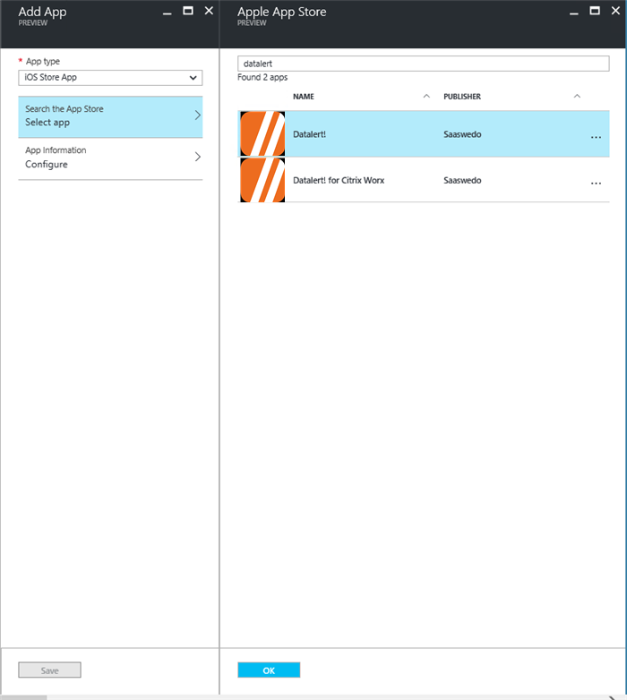

# Set up a telecom expense management service in Intune
[!INCLUDE[azure_portal](./includes/azure_portal.md)]

Intune enables you to manage telecom expenses incurred from data usage on corporate-owned mobile devices. To enable this capability, Intune has integrated with the third-party software developer Saaswedo’s Datalert telecom expense management solution. Datalert is real-time telecom expense management software that lets you manage telecom data usage and avoid costly and unexpected data and roaming overages for your Intune-managed devices.

Intune's integration with Datalert enables you to centrally set, monitor and enforce roaming and domestic data usage limits by using automated alerts when the limits exceed defined thresholds. You can configure the service to apply different actions to individuals or groups of end users, including disabling roaming, when users exceed the threshold. Reports that provide data usage and monitoring information are available from the Datalert management console.

The following diagram shows how Intune integrates with Datalert.

  

Before you can use the Datalert service with Intune, you need to configure settings in the Datalert console and in Intune. The connection must be turned on for the Datalert service and for Intune. If the Datalert side of the connection is enabled, but not the Intune side, Intune receives the communication, but ignores it.

## Supported platforms

- Samsung Knox
- iOS 8.0 and later

## Prerequisites

- A subscription to Microsoft Intune, and access to the Azure portal.
- A subscription to the Datalert telecom expense management service

## List of telecom expense management providers

Intune currently integrates with the following telecom expense management providers:

[Saaswedo Datalert telecom expense management service](http://www.datalert.biz/)

## Deploy the Intune and Datalert integrated solution

Before you start, make sure that you already have an Intune and a Datalert telecom expense management service subscription.

### Step 1: Connect the Datalert service to Microsoft Intune

1. Sign into the Datalert management console with your administrator credentials.

2. On the Datalert management console, go to the **Settings** tab, and then to **MDM configuration**.

3. Select **Unblock** to enable you to enter the settings on the page.

4. For **Server MDM**, choose **Microsoft Intune**.

5. For **Azure AD domain**, enter your Azure tenant ID, and then select the **Connection** button.

    Selecting **Connection** makes the Datalert service check in with Intune to ensure that there are no pre-existing Datalert connections with Intune. After a few seconds, a Microsoft log-in page appears, followed by the Datalert Azure authentication.

6. On the Microsoft authentication page, select **Accept**. You are redirected to a Datalert “thank you” page, which closes after a few seconds. Datalert validates the connection, and displays green check marks beside a list of items that it validated. If the validation fails, you see a message in red. If this happens, contact Datalert Support for help.

    The following screenshot shows the green check marks that you can expect to see once the connection is successful.

  

### Step 2: Check that the telecom expense management feature is Active in Intune

After you complete Step 1 above, your connection should be automatically enabled, and a connection status of **Active** should be showing in the Azure portal. These steps show you how to check for the **Active** status.

1. Sign into the [Azure portal](https://portal.azure.com).

2. Choose **All services** > **Intune**. Intune is located in the **Monitoring + Management** section.

3. On the **Intune** pane, choose **Device configuration**.

4. On the **Device configuration** pane, choose **Setup** > **Telecom Expense Management**.

   Look for the **Active** connection status at the top of the page.

  

### Step 3: Deploy the Datalert app to corporate enrolled devices

To ensure that data usage from only corporate-owned lines is collected, you need to create device categories in Intune, and then target the Datalert app to only corporate phones. Complete the steps in the following subsections.

#### Define device categories and device groups mapped to the categories

Depending on your organizational needs, you'll need to create at least two device categories (for example, Corporate and Personal) and create dynamic device groups for each category. You can create more categories for your organization, as needed.

These categories will be shown to users during enrollment. Depending on which category users choose, the enrolled device will be moved to the corresponding device group. For steps on how to create device categories, see [Map devices to groups](device-group-mapping.md).

  

#### Create the Datalert app in Intune

Follow these steps to create the Datalert app in Intune for each platform. iOS is used as an example in these steps.

1. On the **Intune** pane of the [Azure portal](https://portal.azure.com), choose **Mobile apps**.

2. On the **Mobile apps** pane, choose **Manage** > **Apps**.

3. Select **Add** to add an app.

4. Select the app type. For example, for iOS, you would select **iOS Store App**.

5. In **Search the App Store**, look for the Datalert app by typing **Datalert** in the search window.

6. Select the **Datalert** app, and choose **Select**.

   

7. Complete the remaining steps to create an app for iOS.

   

#### Assign the Datalert app to the corporate device group

1. From the **Mobile apps - Apps** pane, select the iOS Datalert app that you created in the previous step.

2. On the **Apps** pane, choose **Manage** > **Assignments**.

3. Choose **Add group**, and follow the steps to select the corporate device group.

4. Choose whether to make the app installation required or optional for the group. The following example screenshot shows the installation as required, which means that users must install the Datalert app installation after enrolling their device.

  

### Step 4: Add corporate paid phone lines to the Datalert console

You now have configured the Intune and Datalert services to communicate with each other. You now need to add your corporate paid phone lines to the Datalert console and define thresholds and actions for any cellular or roaming usage violations. You can either add corporate paid phone lines to the Datalert console manually or have the lines added automatically after the device is enrolled into Intune.

To set these items, go to the [Datalert setup for Microsoft Intune page](http://www.datalert.fr/microsoft-intune/intune-setup) (http://www.datalert.fr/microsoft-intune/intune-setup), and follow the steps in the setup wizard under the **Settings** tab.

  

The Datalert service is now active, and it starts monitoring data usage and disabling cellular and roaming data on devices that exceed the configured usage limits.

## Client enrollment experience
For client enrollment experience see following:
-	[Enroll your iOS device in telecom expense management](https://docs.microsoft.com/intune-user-help/enroll-your-device-with-telecom-expense-management-ios)
-	[Enroll your Android device in telecom expense management](https://docs.microsoft.com/intune-user-help/enroll-your-device-with-telecom-expense-management-android)

## Turning off the Datalert service

If you disable the Datalert service in the Azure portal:

- All of the actions that have been applied to devices, due to past violations of the usage limits, are undone.
- Users are no longer blocked from data access and roaming.
- Intune still receives the signals coming from the service, but ignores them.

**To turn off the service**

1. On the **Telecom Expense Management** pane in the Azure portal, select **Disable**.

2. Select **Save**.

## Viewing data usage and roaming reports

At this time, data usage reporting is available only in Saaswedo’s Datalert management console.

The instructions that your end users follow to install the Datalert app will be added soon.
