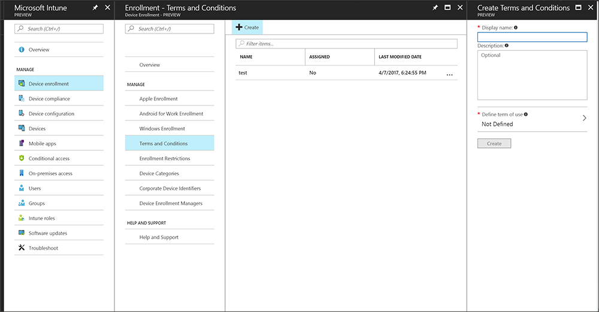
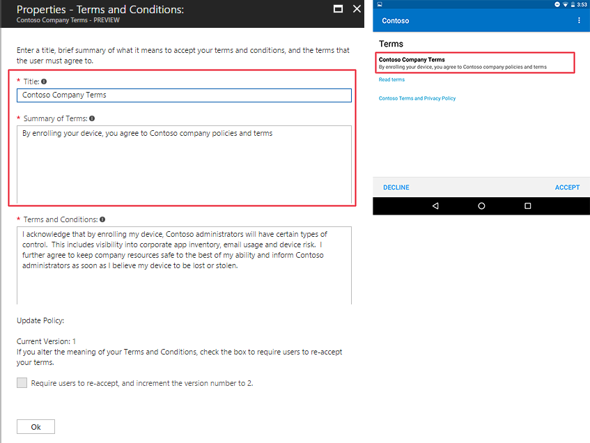
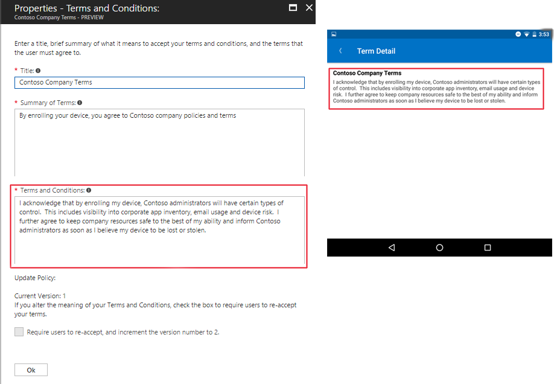

---
# required metadata

title: Set terms and conditions in Microsoft Intune
titlesuffix: 
description: Set terms and conditions that users see in the Company Portal for Intune.
keywords:
author: ErikjeMS
ms.author: erikje
manager: dougeby
ms.date: 10/31/2017
ms.topic: article
ms.prod:
ms.service: microsoft-intune
ms.technology:
ms.assetid: 4a3a11a8-9c0c-4334-8c6b-6fea4d0a2efb

# optional metadata

#ROBOTS:
#audience:
#ms.devlang:
ms.reviewer: amyro
ms.suite: ems
#ms.tgt_pltfrm:
ms.custom: intune-azure
---

# Manage your company's terms and conditions for user access

[!INCLUDE[azure_portal](./includes/azure_portal.md)]

As an Intune admin, you can require that users accept your company's terms and conditions before they can use the Company Portal to enroll their devices and access resources like company apps and email. Configuration of terms and conditions is optional.

You can create multiple sets of terms and assign them to different groups, such as to support different languages.

## Create terms and conditions
Complete these steps to create terms and conditions. The display name and description are for administrative use while terms properties are displayed to users in the Company Portal.

1. In the Azure portal, choose **Device enrollment**, and then choose **Terms and Conditions**.
2. Select **Create**.

3. On the expanded blade, specify the following information:

   - **Display name**: The name for the terms in the Azure portal. Users don't see this name.

   - **Description**: Optional details that help you identify this set of terms in the Azure portal.

4. Select the arrow next to Define terms of use to open the Terms and Conditions blade, and then enter the following information:

   

   - **Title**: The name for your terms that users see in the Company Portal above the **Summary**.
   - **Summary of Terms**: Text that explains what it means when users accept the terms. For example, "By enrolling your device, you are agreeing to the terms of use set out by Contoso. Read the terms carefully before proceeding."
   - **Terms and Conditions**: The terms and conditions that users see and must either accept or reject.

5. Select **Ok** and then select **Create**.

## See how terms are displayed to your users
The following example shows the **Title** and **Summary of Terms** in the admin console and Company Portal.

The following example shows the terms and conditions in the admin console and the Company Portal.

## Assign terms and conditions

You can assign terms and conditions to groups of user who must accept them before using the Company Portal.

1. In the Azure portal, choose **Device enrollment**, and then choose **Terms and Conditions**.
2. In the list of terms and conditions, select the terms you want to assign, and then select **Assigned Groups**.

3. Click the **Select Group** button and in the **Select Groups** blade, select the groups you want to assign the terms, and then click **Select**. Dynamic groups cannot be assigned Terms and Conditions.
4. In the **Assigned Groups** blade, click **Save**.  The terms and conditions are now assigned to users in the selected groups. Users will be prompted to accept terms the next time they access the company portal. The terms and conditions only need to be accepted once. Users with multiple devices don't have to accept on each device.

## Monitor terms and conditions

1. In the Azure portal, choose **More Services** > **Monitoring + Management** > **Intune**. On the Intune blade, choose **Device enrollment**, and then choose **Terms and Conditions**.
2. In the list of terms and conditions, select the terms you want to view acceptance for, and then select **Acceptance Statuses**.

## Work with multiple versions of terms and conditions
You can edit your terms and conditions and manage their versions. We recommend that you increase the version number and require acceptance any time you make significant changes to your terms and conditions. Keep the current version number if, for example, you are fixing typos or changing formatting.

1. In the Azure portal, choose **More Services** > **Monitoring + Management** > **Intune**.

2. On the Intune blade, choose **Device enrollment**,  choose **Terms and Conditions**, select the terms and conditions you want to modify, and then select **Properties**.

4. On the **Properties** blade, select **Terms and Conditions** and then modify the **Title**, **Summary of Terms**, and **Terms and Conditions** as needed. If the changes you made make it necessary for users to reaccept the new terms, click **Require users to re-accept, and increment the version number to**

4.  Select **OK** and then select **Save**.

Users only have to accept updated terms and conditions once. Users with multiple devices don't have to accept terms and conditions on each device.
