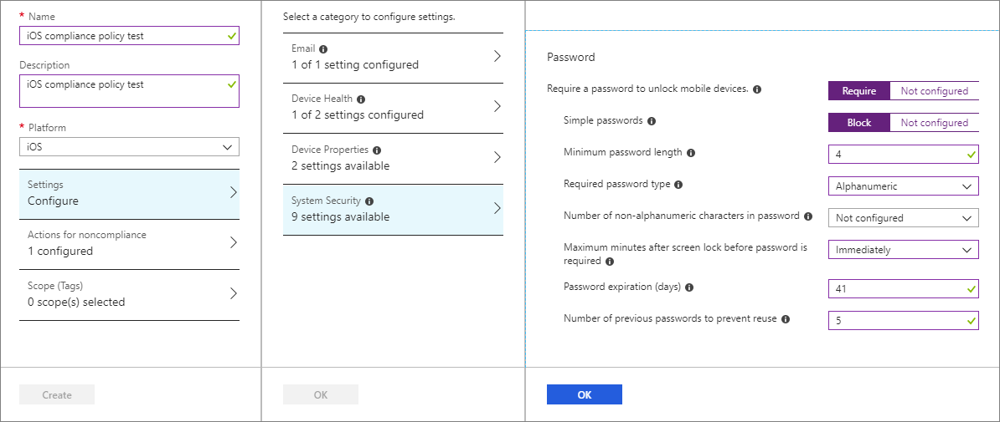
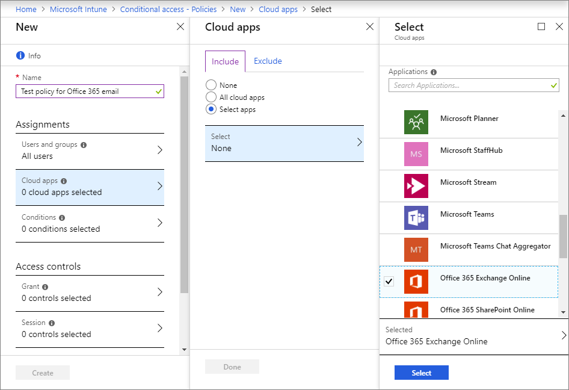
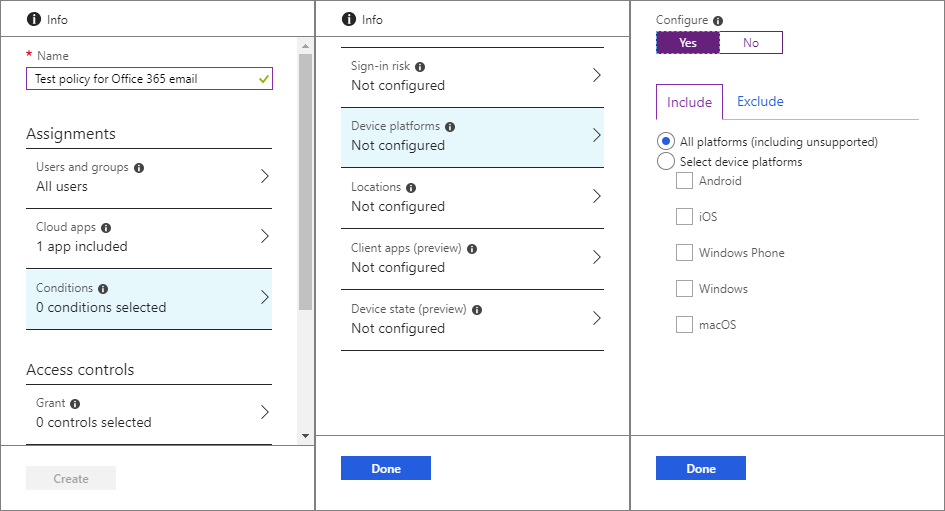
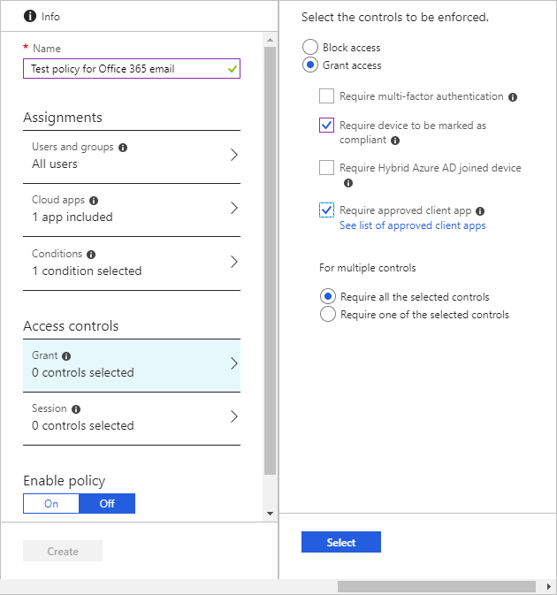

---
# required metadata

title: Tutorial - Secure Office 365 email on enrolled devices
titlesuffix: Microsoft Intune
description: Learn how to use device compliance policies and conditional access to protect email by requiring iOS devices to be managed by Intune.
keywords:
author: msmimart
ms.author: mimart
manager: dougeby
ms.date: 09/19/2018
ms.topic: quickstart
ms.prod:
ms.service: microsoft-intune
ms.technology:
ms.assetid: 

# optional metadata

#ROBOTS:
#audience:
#ms.devlang:
ms.reviewer:
ms.suite: ems
#ms.tgt_pltfrm:
ms.custom: intune-azure

---

# Tutorial: Protect Office 365 email on enrolled devices

Learn about setting up device compliance policies with conditional access to make sure that iOS devices can access Office 365 Exchange Online email only if they’re managed by Intune. An Intune iOS device compliance policy determines the rules and settings that iOS devices must meet to be compliant, and conditional access policies allow or block access based on the compliance status of devices that try to access Exchange Online.
In this tutorial, you will learn how to: 
  - Set up an Intune device compliance policy to evaluate the compliance status of a device.
  - Set a conditional access policy to require iOS devices to enroll in Intune and use the approved Outlook mobile app to access Office 365 Exchange Online email.

## Prerequisites
  - Create a test device profile for iOS devices by following the steps in [Quickstart: Create an email device profile for iOS](intune/quickstart-email-profile.md).
  - If you don’t have an Intune subscription, [sign up for a free trial account](free-trial-sign-up.md).

## Sign in to Intune

Sign in to the [Intune](https://aka.ms/intuneportal) as a Global Administrator or an Intune Service Administrator. Intune is located in the Azure portal by choosing **All services** > **Intune**.

## Create a device compliance policy for iOS
Set up an Intune device compliance policy to set up the conditions that a device must meet to be considered compliant. For this tutorial, we’ll create a device compliance policy for iOS devices. Note that compliance policies are platform-specific, so you need a separate compliance policy for each device platform you want to evaluate.

1.	In Intune, select **Device compliance** > **Policies** > **Create Policy**.
2.	In **Name**, enter **iOS compliance policy test**. 
3.	In **Description**, enter **iOS compliance policy test**.
4.	Under **Platform**, select **iOS**. 
5.	Select **Settings** > **Email**. 

    a. Next to **Require mobile devices to have a managed email profile**, select **Require**.

    b. Select **OK**.

     
    
6.	Select **Device Health**. Next to **Jailbroken devices**, select **Block**, and then select **OK**.
7.	Select **System Security** and enter **Password** settings. For this tutorial, select the following generally recommended settings:

   - For **Require a password to unlock mobile devices**, select **Require**.
   - For **Simple passwords**, select **Block**.
   - For **Minimum password length**, enter **4**.
   - For **Required password type**, choose **Alphanumeric**.
   - For **Maximum minutes after screen lock before password is required**, choose **Immediately**.
   - For **Password expiration (days)**, enter **41**.
   - For **Number of previous passwords to prevent reuse**, enter **5**.
 
     

8.	Select **OK**, and then select **OK** again.
9.	Select **Create**.

## Create a conditional access policy to require Intune enrollment
Now we’ll create a conditional access policy that requires all device platforms to be enrolled in Intune and compliant with our Intune compliance policy before they can access Exchange Online. We will also require the Outlook app for email access. Conditional access policies are configurable in either the Azure AD portal or the Intune portal. Since we’re already in the Intune portal, we’ll create the policy here.
1.	In Intune, select **Conditional access** > **Policies** > **New policy**.
2.  In **Name**, enter **Test policy for Office 365 email**. 
3.	Under **Assignments**, select **Users and groups**. 

   - On the **Include** tab, select **All users**, and then select **Done**.

4.	Under **Assignments**, select **Cloud apps**. Because we want to protect Office 365 Exchange Online email, we’ll do the following:
 
    a. On the **Include** tab, select **Select apps**, and then choose **Select**. 

    b. In the applications list, select **Office 365 Exchange Online**, and then choose **Select**. 

    c. Select **Done**.
  
     

5.	Under **Assignments**, select **Conditions** > **Device platforms**.

    a. Under **Configure**, select **Yes**.

    b. On the **Include** tab, select **All platforms (including unsupported)**, and then select **Done**. 

    c. Select **Done** again.
   
     

6.	Under **Assignments**, select **Conditions** > **Client apps**.

    a. Under **Configure**, select **Yes**.

    b. Select **Mobile apps and desktop clients**.
 
    c. Select **Modern authentication clients** (which refers to apps like Outlook for iOS and Outlook for Android).
 
    e. Select **Done**.
    
     

7.	Under **Access controls**, select **Grant**. 

    a. On the **Grant** pane, select **Grant access**.

    b. Select **Require device to be marked as compliant**. 

    c. Select **Require approved client app**.

    d. Under **For multiple controls**, select **Require all the selected controls** so that both requirements you selected are enforced when a device tries to access email.

    a. Choose **Select**.
     
     

8.	Under **Enable policy**, select **On**.
     
     

9.	Select **Create**.

## Try it out
With the policies you’ve just created, any iOS device that attempts to sign in to Office 365 email will be required to enroll in Intune and use the Outlook mobile app for iOS. You can test this by opening the native email app on an iOS device and attempting to sign in to Office 365 email by using credentials from your test tenant. You’ll be prompted to enroll the device and install the Outlook mobile app.

## Clean up resources
When no longer needed, you can remove the test policies.
1. Sign in to the [Intune](https://aka.ms/intuneportal) as a Global Administrator or an Intune Service Administrator.
2. Select **Device Compliance** > **Policies**.
3. In the **Policy Name** list, select the context menu (**...**) for your test policy, and then **Delete**. Select **OK** to confirm.
4. Select **Conditional Access** > **Policies**.
5. In the **Policy Name** list, select the context menu (**...**) for your test policy, and then select **Delete**. Select **Yes** to confirm.

 ## Next steps 
In this tutorial, you created policies to require any iOS device that attempts to sign in to Office 365 email to enroll in Intune and use Outlook mobile app for iOS. To learn about using conditional access to protect other apps and services, including Exchange ActiveSync clients for Office 365 Exchange Online, see How to set up conditional access with Intune.
