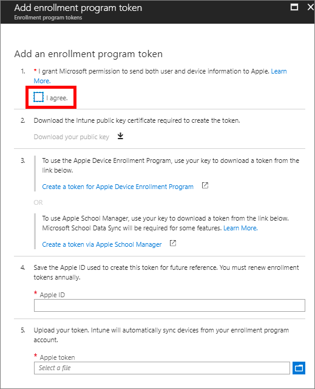

---
# required metadata

title: Tutorial - Use the Device Enrollment Program to enroll iOS devices in Intune
titleSuffix: Microsoft Intune
description: In this tutorial, you'll set up Apple's DEP to enroll iOS devices in Intune.
keywords:
author: ErikjeMS
ms.author: erikje
manager: dougeby
ms.date: 1/30/2019
ms.topic: tutorial
ms.prod:
ms.service: microsoft-intune
ms.technology:
ms.assetid: 
Customer intent: As an Intune admin, I want to set up the Device Enrollment Program so that users can automatically enroll in Intune.
ms.collection: M365-identity-device-management
---

# Tutorial: Use the Device Enrollment Program to enroll iOS devices in Intune
Apple's Device Enrollment Program (DEP) simplifies enrolling devices. With Microsoft Intune and DEP, devices are automatically enrolled the first time the user turns on the device. You can therefore ship devices to many users without having to set up each device individually. 

In this tutorial, you'll learn how to:
> [!div class="checklist"]
> * Get an Apple DEP token
> * Create an Autopilot device group
> * Create an Autopilot deployment profile
> * Assign the Autopilot deployment profile to the device group
> * Distribute Windows devices to users

If you don’t have an Intune subscription, [sign up for a free trial account](free-trial-sign-up.md).

## Prerequisites
- Devices purchased in [Apple's Device Enrollment Program](http://deploy.apple.com)
- Set the [mobile device management authority](mdm-authority-set.md)
- Get an [Apple MDM Push certificate](apple-mdm-push-certificate-get.md)

## Get an Apple DEP token
Before enrolling iOS devices with DEP, you need an Apple DEP token (.pem) file. This token lets Intune sync information about DEP devices that your corporation owns. It also permits Intune to upload enrollment profiles to Apple and to assign devices to those profiles.

You use the Apple DEP portal to create a DEP token. You also use the DEP portal to assign devices to Intune for management.

1. In [Intune in the Azure portal](https://aka.ms/intuneportal), choose **Device enrollment** > **Apple enrollment** > **Enrollment Program Tokens** > **Add**.

2. Grant permission to Microsoft to send user and device information to Apple by selecting **I agree**.

   

3. Choose **Download your public key** to download and save the encryption key (.pem) file locally. The .pem file is used to request a trust-relationship certificate from the Apple Device Enrollment Program portal.

4. Choose **Create a token for Apple's Device Enrollment Program** to open Apple's Deployment Program portal, and sign in with your company Apple ID. You can use this Apple ID to renew your DEP token.

5.  In Apple's [Deployment Programs portal](https://deploy.apple.com), choose **Get Started** for **Device Enrollment Program**.

4. On the **Manage Servers** page, choose **Add MDM Server**.

5. For **MDM Server Name**, enter *TestMDMServer* and then choose **Next**. The server name is for your reference to identify the mobile device management (MDM) server. It isn't the name or URL of the Microsoft Intune server.

6. The **Add &lt;ServerName&gt;** dialog box opens, stating **Upload Your Public Key**. Choose **Choose File…** to upload the .pem file, and then choose **Next**.

6. Go to  **Deployment Programs** > **Device Enrollment Program** > **Manage Devices**.
7. Under **Choose Devices By**, choose **Serial Number**. <!--ask Tiffany about this-->

8. For **Choose Action**, choose **Assign to Server**, choose the &lt;ServerName&gt; specified for Microsoft Intune, and then choose **OK**. The Apple portal assigns the specified devices to the Intune server for management and then displays **Assignment Complete**.

   In the Apple portal, go to **Deployment Programs** &gt; **Device Enrollment Program** &gt; **View Assignment History** to see a list of devices and their MDM server assignment.

9. For future reference, in Intune in the Azure portal, provide the Apple ID used to create this token.

    

10. In the **Apple token** box, browse to the certificate (.pem) file, choose **Open**, and then choose **Create**. 

## Create an Apple enrollment profile
Now that you've installed your token, you can create an enrollment profile for DEP devices. A device enrollment profile defines the settings applied to a group of devices during enrollment.

1. In Intune in the Azure portal, choose **Device enrollment** > **Apple Enrollment** > **Enrollment program tokens**.

2. Select the token you just installed, choose **Profiles** > **Create profile**.

3. Under **Create Profile**, enter *TestDEPProfile* for **Name** and *Testing DEP for iOS devices* for **Description**. Users do not see these details.

4. For **User Affinity**, choose **Enroll with User Affinity**. This option is for devices that belong to users that want to use the Company Portal for services like installing apps.

5. Choose **No** under **Authenticate with Company Portal instead of Apple Setup Assistant**.

6. Choose **Device Management Settings** and choose **No** under **Supervised**. Supervised devices give you more management options, but you won't use it for the purposes of this tutorial.

7. Choose **OK**.

8. Choose **Setup Assistant customization** and enter *Tutorial department* for **Department Name**. This string is what users see when they tap **About configuration** during device activation.

9. Under **Department Phone**, enter a phone number. This number appears when users tap the **Need help** button during activation.

10. You can **Show** or **Hide** a variety of screens during device activation. For the purposes of this tutorial, set **Passcode** to **Show** and all the others to **Hide**.

11. Choose **OK** > **Create**.

## Sync managed devices

You can now see which devices are assigned to this token.

1. In Intune in the Azure portal, choose **Device enrollment** > **Apple Enrollment** > **Enrollment program tokens** > choose a token in the list > **Devices** > **Sync**.

## Assign an enrollment profile to iOS devices

You must assign an enrollment program profile to devices before they can enroll.

1. In Intune in the Azure portal, choose **Device enrollment** > **Apple Enrollment** > **Enrollment program tokens** > choose your token in the list.
2. Choose **Devices** > choose devices in the list > **Assign profile**.
3. Under **Assign profile**, choose a profile for the devices > **Assign**.

## Distribute devices to users

You've set up management and syncing between Apple and Intune, and assigned a profile to let your DEP devices enroll. You can now distribute devices to users. Devices with user affinity require each user be assigned an Intune license.

## Clean up resources

If you don't want to use Autopilot devices anymore, you can delete them.

- If the devices are enrolled in Intune, you must first [delete them from the Azure Active Directory portal](devices-wipe.md#delete-devices-from-the-azure-active-directory-portal).

<!--ask tiffany how to do this-->

## Next steps

You can find more information about other options available for enrolling iOS devices.

> [!div class="nextstepaction"]
> [In-depth iOS DEP enrollment article](device-enrollment-program-enroll-ios.md)
