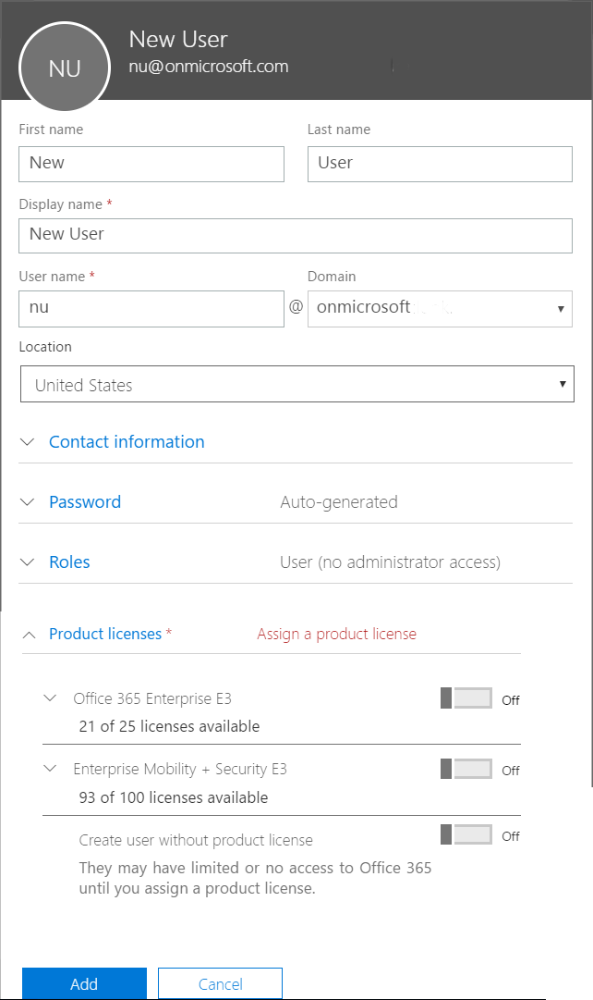

---
# required metadata

title: Add users and grant permissions
description:  Synchronize on-premises users with Azure AD and grant administrator permissions for your Intune subscription
keywords:
author: nathbarn
ms.author: nathbarn
manager: angrobe
ms.date: 06/22/2017
ms.topic: get-started-article
ms.prod:
ms.service: microsoft-intune
ms.technology:
ms.assetid: 6e9ec662-465b-4ed4-94c1-cff0fe18f126

# optional metadata

#ROBOTS:
#audience:
#ms.devlang:
ms.reviewer: angrobe
ms.suite: ems
#ms.tgt_pltfrm:
ms.custom: intune-classic

---

# Add users and give administrative permission to Intune

[!INCLUDE[both-portals](./includes/note-for-both-portals.md)]

This topic tells administrators how they can add users to Intune and what administrative permissions are available in the Intune service.

As an administrator, you can add users directly or synchronize users from your on-premises Active Directory. Once added, users can enroll devices and access company resources. You can also give users additional permissions including *global administrator* and *service administrator* permissions.

## Add users to Intune
You can manually add users to your Intune subscription via the [Office 365 portal](https://www.office.com/signin) or the Azure Intune portal, but they might not automatically be assigned an Intune license. An administrator can edit user accounts to assign Intune licenses. This can be done from either the Office 365 portal or the Intune Azure portal. For additional guidance on using the Office 365 portal, see [Add users individually or in bulk to the Office 365 portal](https://support.office.com/article/Add-users-individually-or-in-bulk-to-Office-365-Admin-Help-1970f7d6-03b5-442f-b385-5880b9c256ec).

### Add Intune users in the Office 365 Admin Center
1. Sign in to [Office 365 portal](https://www.office.com/signin).
2. In the Office 365 menu, select **Admin**.
3. In the Admin center, select **Add a user**.
  
4. Specify the following user details:
  - **First name**
  - **Last name**
  - **Display name** - Displayed in Intune portal
  - **User name** - UPN name in Intune portal
  - **Location**
  - **Contact information** (optional)
  - **Password** - Auto-generate or specify
     
5. Assign an Intune license. Select **Product licenses** and choose the product license to assign the user.
6. Choose **Add** to create the new user.

### Add Intune users in the Azure Intune portal
1. Sign in to [Azure portal](https://portal.azure.com). and go **Monitoring + Management** > **Intune**. You can also *search resources* for **Intune**.
2. Select **Users**.
3. In the Admin center, select **Add a user**.
  
4. Specify the following user details:
  - **Name**
  - **User name** - The new name in Azure Active Directory portal
  
  Choose **OK** to continue.
5. Optionally, you can specify the following:
  - **Profile** - Work information including **Job title** and **Department**
  -  **Groups** - Select groups to add for the user
  - **Directory role** - Give the user administrative permissions for Intune

  Select **Create** to add the new user to Intune.
6. Select **Profile**, and then choose a **Usage location** for the new user. Usage location is required before you can assign the new user an Intune license. Choose **Save** to continue.
    
7. Select **Licenses** and then choose **Assign** to assign an Intune license for this user. An Intune license is required to enroll devices or access company resources. Select **Products**, choose the license type, choose **Select**, and then choose **Assign**.

## Grant admin permissions

After you've added users to your Intune subscription, we recommend that you grant a few user accounts administrative permission. :
-   [Global administrator](#tenant-administrator): Use the Office 365 portal to assign this type of administrator to manage your subscription, including billing, cloud storage, and managing the users who can use Intune.
-   [Customized or limited administrator](#service-administrator): Use the Office 365 or Azure Intune console to assign this type of administrator for day-to-day tasks including device and computer management, deploying policy and apps, and running reports.

### Types of administrators

Users can be assigned one or more administrator permissions, which define the administrative scope for that user and the tasks they can manage. Administrator permissions are common between the different Microsoft cloud services, although some services might not support some permissions. Intune uses the following administrator permissions:

- **Global administrator** - (Office 365 and Intune) Accesses all administrative features in Intune. By default the person who signs up for Intune becomes a Global admin. Global admins are the only admins who can assign other admin roles. You can have more than one global admin in your organization. As a best practice we recommend that only a few people in your company have this role to reduce the risk to your business.
- **Billing administrator** - (Office 365 and Intune) Makes purchases, manages subscriptions, manages support tickets, and monitors service health.
- **Password administrator** - (Office 365 and Intune) Resets passwords, manages service requests, and monitors service health. Password admins are limited to resetting passwords for users.
- **Service administrator** - (Office 365) Opens support requests with Microsoft, and views the service dashboard and message center. They have “view only” permissions except for opening support tickets and reading them.
- **User management administrator** - (Office 365 and Intune) Resets passwords, monitors service health, adds and deletes user accounts, and manages service requests. The user management admin can’t delete a global admin, create other admin roles, or reset passwords for billing, global, and service admins.
<!--
- **Compliance administrator** -  (Intune) View and manage compliance permissions.
- **Security Reader** - (Intune) Permission to read security information and reports.
- **Security administrator** (Intune) Permission to view and manage security configuration and reports.
- **Privileged role administrator** - (Intune) Permission to perform role management-related tasks.
- **Guest inviter** (Intune) Permission to invite guest users.
- **Conditional access administrator** - (Intune) -->

By default, the account you use to create your Microsoft Intune subscription is a tenant administrator with the global administrator role. As a tenant administrator, you use the Intune administrator console to manage your subscription for Intune and assign tenant administrators from the [Office 365 portal](http://go.microsoft.com/fwlink/p/?LinkId=698854). Use a tenant administrator with the global administration role to access the portal and assign your first service administrator. As a best practice, do not use a tenant administrator for day-to-day management tasks. A tenant administrator does not require a license to Intune to access the Intune administrator console. The tenant administrator is a common concept between Microsoft cloud services. When you subscribe to Intune, your service is a tenant of Azure AD. See the Azure AD tenant section in [What is an Azure AD directory?](http://technet.microsoft.com/library/jj573650.aspx) for more information.

To access the Office 365 portal, your account must have a sign-in status of **Allowed**. This status is different from having a license to the subscription. By default, all user accounts are **Allowed**. Users without administrator permissions can use the Office 365 portal to reset Intune passwords.

## Sync Active Directory and add users to Intune
You can configure directory synchronization to import user accounts from your on-premises Active Directory to Microsoft Azure Active Directory (Azure AD) which includes Intune users. Having your on-premises Active Directory service connected with all of your Azure Active Directory-based services makes managing user identity much simpler. You can also configure single sign-on features to make the authentication experience for your users familiar and easy. By linking the same [Azure AD tenant](https://azure.microsoft.com/documentation/articles/active-directory-aadconnect/) with multiple services, the user accounts that you have previously synchronized are available to all cloud-based services.

### How to sync on-premises users with Azure AD
The only tool that you need to synchronize your user accounts with Azure AD is the [Azure AD Connect wizard](https://www.microsoft.com/download/details.aspx?id=47594). The Azure AD Connect wizard provides a simplified and guided experience for connecting your on-premises identity infrastructure to the cloud.  Choose your topology and needs (single or multiple directories, password sync or federation), and the wizard will deploy and configure all components required to get your connection up and running. Including: sync services, Active Directory Federation Services (AD FS), and the Azure AD PowerShell module.

> [!TIP]
> Azure AD Connect encompasses functionality that was previously released as Dirsync and Azure AD Sync. Learn more about [directory integration](http://technet.microsoft.com/library/jj573653.aspx). To learn about the benefits of synchronizing user accounts from your local directory to Azure AD, see [Similarities between Active Directory and Azure AD](http://technet.microsoft.com/library/dn518177.aspx).
