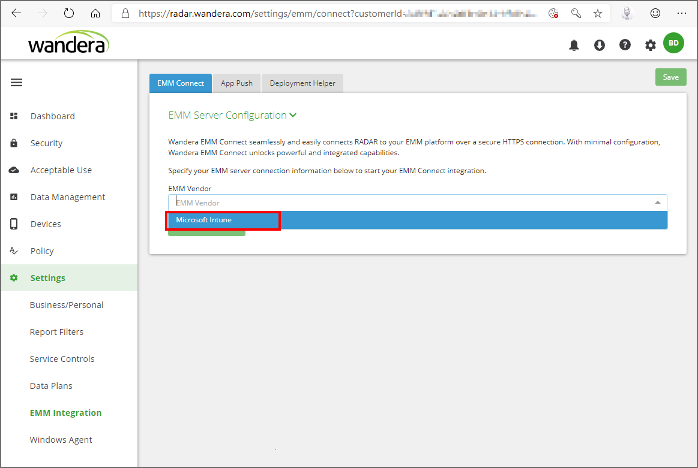
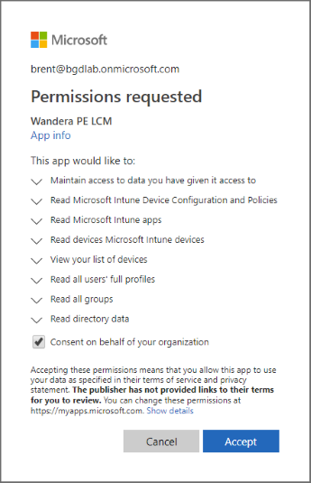
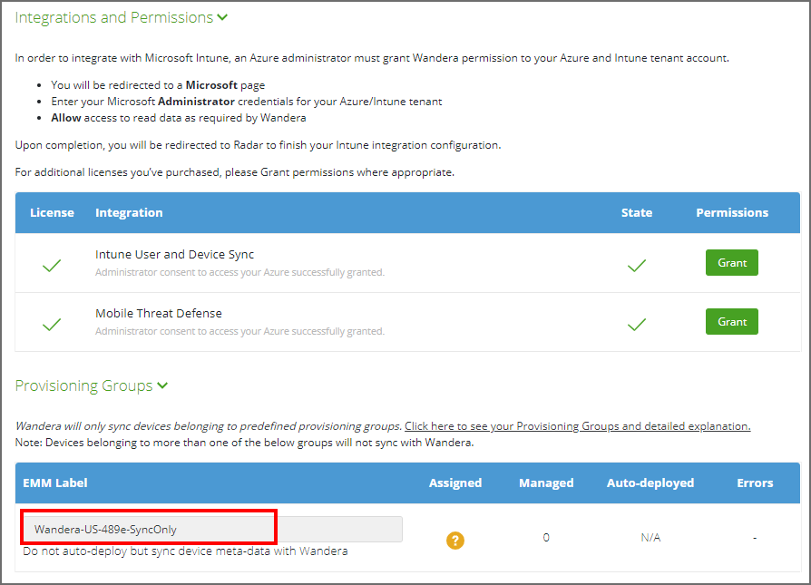

---
# required metadata

title: Set up Wandera Mobile Threat Protection integration with Intune
titleSuffix: Intune on Azure
description: How to set up the Wandera Mobile Threat Protection solution with Microsoft Intune to control mobile device access to your corporate resources.
keywords:
author: brenduns
ms.author: brenduns
manager: dougeby
ms.date: 06/20/2019
ms.topic: conceptual
ms.service: microsoft-intune
ms.localizationpriority: high
ms.technology:
ms.assetid:  

# optional metadata

#ROBOTS:
#audience:
#ms.devlang:
#ms.reviewer: davidra
#ms.suite: ems
search.appverid: MET150
#ms.tgt_pltfrm:
#ms.custom:
ms.collection: M365-identity-device-management
---  

# Integrate Wandera Mobile Threat Protection with Intune  

Complete the following steps to integrate the Wanadera Mobile Threat Defense solution with Intune.  

## Before you begin  

Before you start the process to integrate Wandera Mobile Threat Protection with Intune, make sure you have the following prerequisites in place:
- Microsoft Intune subscription  
- Azure Active Directory admin credentials to grant the following permissions:  
  - Sign in and read user profile  
  - Access the directory as the signed-in user  
  - Read directory data  
  - Send device information to Intune  
- Wandera subscription, with the the following:
  - One or more Wandera accounts that are licensed for EMM Connect 
  - An account with Super administrator privileges in Wandera
  - To configure the +WiFi functionallity you'll need an additional license.  See [WiFi Functionality](https://wandera.force.com/Customer/s/article/ka1b0000000g5T7AAI?r=21&ui-comm-runtime-components-aura-components-siteforce-qb.Quarterback.validateRoute=1&ui-communities-components-aura-components-forceCommunity-controller.Headline.getInitData=1&ui-communities-components-aura-components-forceCommunity-seoAssistant.SeoAssistant.getSeoData=1&ui-force-components-controllers-recordGlobalValueProvider.RecordGvp.getRecord=1&ui-self-service-components-controller.ArticleTopicList.getTopics=1&ui-self-service-components-controller.ArticleView.getArticleHeaderDetail=1) in the Wandera Knowledge Base.

### Wandera Mobile Threat Defense app authorization  

The Wandera Mobile Threat Defense app authorization process:  
- Allow the Wandera Mobile Threat Defense service to communicate information related to device health state back to Intune.  
- Wandera syncs with Azure AD Enrollment Group membership to populate its device's database.  
- Allow the Wandera RADAR admin portal to to use Azure AD Single Sign On (SSO).  
- Allow the Wandera Mobile Threat Defense app to sign in using Azure AD SSO.  

## To set up Wandera Mobile Threat Defense integration  
Setup of *EMM Connect* requires a one-time configuration process that you complete in both the Intune and Wandera consoles. The configuration process takes about 15 minutes, and you can complete the configuration without coordination with your Wandera technical account or support representative.  

1. Sign in to [Intune](https://go.microsoft.com/fwlink/?linkid=2090973) and go to **Device compliance** > **Mobile Threat Defense** > and select **Add**.

2. On the **Add Connector** page, use the dropdown and select **Wandera**. And then select **Create**.  

3. On the Mobile Threat Defense pane, select the **Wandera** MTD Connector from the list of connectors to open the *Edit connector* pane, and then select **Open the Wandera admin console** to open [RADAR](https://radar.wandera.com/login), the Wandera admin console, and sign in. 

4. In the Wandera console, go to **Settings** > **EMM Integration**, and select the **EMM Connect** tab. Use the *EMM Vendor* drop down and select *Microsoft Intune*.

   

5. Select **Grant permissions** to open a connection to the Intune portal. Sign in using your Intune admin credentials, select the checkbox and then **Accept** the permissions request.  

    

6. Wandera completes the connection and returns you to the RADAR admin console. Repeat the process to **Grant** access for additional configurations, as needed. 

    While in the RADAR console, copy the name of the **SyncOnly** group that appears below **EMM Label**. You'll use this name to configure a group in Intune for synchronization in a later step.

    

7. Sign back in to [Intune](https://go.microsoft.com/fwlink/?linkid=2090973), and return to edit the Wandera MTD Connector. Set the available toggles to **On**, and the **Save** the configuration.  

    

8. In the Intune console, go to **Groups** and select **New group**. Specify the following:
   - **Group type**: **Security**
   - **Group name**: Specify the **SyncOnly** name from the Wandera RADAR admin console.
   - **Members**: Assign the Wandera iOS and Android apps to this group, and add the Managed App Configuration for the iOS app.
  
   Select **Create** to save the group. 
 

 

 

Next, c

1. When the message **Successful Integration** appears, integration is complete.  
1. In the Intune console, Sophos is now available.  

## Next Steps  
[Configure Sophos client apps](mtd-apps-ios-app-configuration-policy-add-assign.md)
