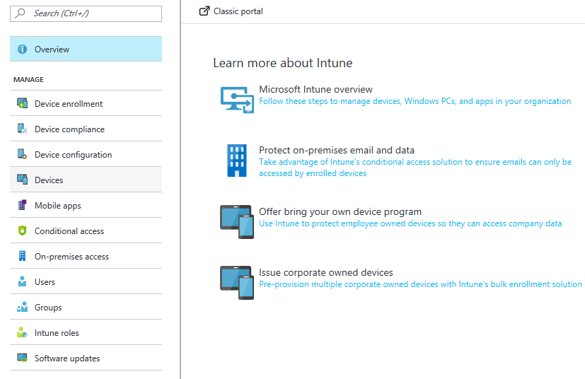

---
# required metadata

title: Introduction to Intune in the Azure portal
titlesuffix: "Azure portal"
description: Get the basics about Intune in the Azure portal, and how it can help you manage your devices."
keywords:
author: arob98
ms.author: angrobe
nmanager: dougeby
ms.date: 02/14/2018
ms.topic: get-started-article
ms.prod:
ms.service: microsoft-intune
ms.technology:
ms.assetid: 4a085264-232a-4af0-97f1-747496c44517

# optional metadata

#ROBOTS:
#audience:
#ms.devlang:
#ms.reviewer:
ms.suite: ems
#ms.tgt_pltfrm:
ms.custom: 

---

# Introduction to Microsoft Intune in the Azure portal

[!INCLUDE[azure_portal](./includes/azure_portal.md)]

Similar to other Azure services, Microsoft Intune is available in the Azure portal. By selecting **Intune** within the Azure portal, you can manage your organization's mobile devices, PCs, and apps.

>[!NOTE] 
> If you've used a previous version of Microsoft Intune, you may find the following information helpful:
    * [Where did my features go in Azure?](ui-changes.md) is a reference to show you the specific workflows and UIs that have changed with the move to Azure.
    * [Intune classic groups in the Azure portal](groups-get-started.md) explains the implications of the shift to Azure Active Directory security groups for group management.

Highlights of the Microsoft Intune experience in the Azure portal include:

- An integrated console for all your Enterprise Mobility + Security (EMS) components
- An HTML-based console built on web standards
- Microsoft Graph API support to automate many actions
- Azure Active Directory (AD) groups to provide compatibility across all your Azure applications
- Support for most modern web browsers

## Before you start

To use Intune in the Azure portal, you must have an Intune admin and tenant account. [Sign up for an account](https://portal.office.com/Signup/Signup.aspx?OfferId=40BE278A-DFD1-470a-9EF7-9F2596EA7FF9&dl=INTUNE_A&ali=1#0%20) if you don't already have one.

## Supported web browsers for the Azure portal

The Azure portal runs on most modern PCs, Macs, and tablets. Mobile phones are not supported.
Currently, the following browsers are supported:

- Microsoft Edge (latest version)
- Microsoft Internet Explorer 11
- Safari (latest version, Mac only)
- Chrome (latest version)
- Firefox (latest version)

Check the [Azure portal](https://docs.microsoft.com/azure/azure-preview-portal-supported-browsers-devices) for the latest information about supported browsers.

## Microsoft Intune in the Azure portal

The [Azure portal](https://portal.azure.com) is where you can find the Microsoft Intune service. There are several services in Azure, many of which you may not use on a regular basis. For a quick guide to customize your portal experience, see [Getting started with Intune in the Azure portal](get-started-azure.md).

## The Microsoft Intune documentation

This topic, as well as the entire Microsoft Intune documentation set, is continuously updated. If you have suggestions you'd like to see, leave feedback in the topic comments. We'd love to hear from you.

The documentation reflects the layout of Microsoft Intune in the Azure portal (shown below), so that it is easier to find the information you need.

### Documentation guide

Use the following table to quickly find and understand the major areas of Microsoft Intune.

| Section                                                      | Description                                                                                                                                                                                                                                                                                      |
|--------------------------------------------------------------|--------------------------------------------------------------------------------------------------------------------------------------------------------------------------------------------------------------------------------------------------------------------------------------------------|
| [Introduction and get started](introduction-intune.md)       | Understand the fundamentals of Intune, including: - Common solutions - The way Microsoft Intune works - Device management in Intune - App management in Intune - Enterprise Mobility Management (EMM) with and without device enrollment                                                         |
| [Plan and design](planning-guide.md)                         | Guidance to help you successfully plan and design your Microsoft Intune environment.                                                                                                                                                                                                             |
| [Device enrollment](device-enrollment.md)                    | Understand how Microsoft Intune helps you manage your workforce’s devices by enrolling the devices into the Intune service. There are several methods to enroll your workforce’s devices.                                                                                                         |
| [Device compliance](device-compliance.md)                    | Intune device compliance policies define the rules and settings that a device must comply with in order to be considered compliant by Microsoft Intune. For example, requiring a password for device access, encrypting devices, and requiring a minimum OS version are all compliance examples. |
| [Device configuration](device-profiles.md)                   | Configure the settings and features on all of the devices you manage using Microsoft Intune by creating device profiles. For example, you can configure such capabilities as notifications, data sharing, email support, wi-fi connectivity, certificates, and endpoint protection.              |
| [Devices](device-management.md)                              | Ensure devices you manage are providing the resources your end users need to do their work while protecting your company's data from risk. Manage devices by reviewing the workforce device inventory and performing remote device actions.                                                      |
| [Mobile apps](app-management.md)                             | Understand how to add, deploy, monitor, configure, and protect apps.                                                                                                                                                                                                                             |
| [Conditional access](conditional-access.md)                  | Define device-based and app-based conditions that gate access to your corporate data.                                                                                                                                                                                                            |
| [Users](users-add.md)                                        | Learn how to add users of devices and apps you manage.                                                                                                                                                                                                                                           |
| [Groups](groups-get-started.md)                              | Learn about how you can create and manage groups with Intune. Using groups, you can quickly assign device and app configure and protection policies.                                                                                                                                             |
| [Intune roles](role-based-access-control.md)                 | Learn how to control who can perform various Intune actions, and how those actions are applied. You can either use the built-in roles that cover some common Intune scenarios, or you can create your own roles.                                                                                 |
| [Software updates](windows-update-for-business-configure.md) | Learn how to configure software updates for Windows 10 devices.                                                                                                                                                                                                                                  |

## What's new?

To learn about the latest capabilities of Microsoft Intune, see [What's New](whats-new.md).
