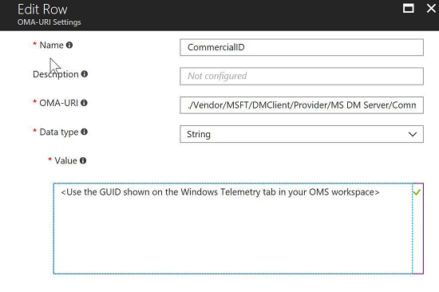

---
# required metadata

title: Configure Windows Update for Business in Microsoft Intune - Azure | Microsoft Docs
description: Update the Software Update settings in a profile to creating an update ring, review compliance, and pause updates in Windows Update for Business settings using Microsoft Intune on Windows 10 devices.
keywords:
author: brenduns
ms.author: brenduns
manager: dougeby
ms.date: 01/15/2019
ms.topic: article
ms.prod:
ms.service: microsoft-intune
ms.technology:

# optional metadata

#ROBOTS:
#audience:
#ms.devlang:
ms.reviewer: coryfe
ms.suite: ems
search.appverid: MET150
#ms.tgt_pltfrm:
#ms.custom:

---

# Manage software updates in Intune

[!INCLUDE [azure_portal](./includes/azure_portal.md)]

Windows as a Service is the way to update Windows 10 devices. With Windows 10, new Feature Updates and Quality Updates include the contents of all previous updates. As long as you've installed the latest update, you know your Windows 10 devices are up-to-date. Unlike with previous versions of Windows, you now must install the entire update instead of part of an update.

By using Windows Update for Business, you simplify the update management experience. You don’t need to approve individual updates for groups of devices. You can manage risk in your environments by configuring an update rollout strategy. And Windows Update makes sure that updates are installed at the right time. Microsoft Intune provides the ability to configure update settings on devices, and gives you the ability to defer update installation. Intune doesn’t store the updates, but only the update policy assignment. Devices access Windows Update directly for the updates. Use Intune to configure and manage **Windows 10 update rings**. An update ring includes a group of settings that configure when and how Windows 10 updates get installed. For example, you can configure the following settings:

- **Windows 10 Servicing Channel**: Choose the servicing channel from which you want groups of devices to receive updates. The following channels are available: 
  - Semi&#8208;Annual Channel
  - Semi&#8208;Annual Channel (Targeted)
  - Windows Insider &#8208; Fast
  - Windows Insider &#8208; Slow
  - Release Windows Insider 
      
  For details on the available servicing channels, see [Overview for Windows as a Service](https://docs.microsoft.com/windows/deployment/update/waas-overview#servicing-channels).
- **Deferral Settings**: Configure update deferral settings to delay update installations for groups of devices. Use these settings to stage your update roll-out so you can review progress along the way.
- **Pausing**: If there's an issue during the update rollout, you can postpone the update installation. 
- **Maintenance window**: Configure the hours in which updates can be installed.
- **Update type**: Choose the types of updates that get installed. For example, Quality Updates, Feature Updates, or drivers.
- **Installation behavior**: Configures how the update gets installed. For example, does the device automatically restart after the installation?
- **Peer downloading**: You choose to configure peer downloading. If configured, when a device has finished downloading an update, other devices can download the update from that device. This setting speeds up the download process.

After you create update rings, you assign them to groups of devices. By using update rings, you can create an update strategy that mirrors your business needs. For more information, see [Manage updates using Windows Update for Business](https://technet.microsoft.com/itpro/windows/manage/waas-manage-updates-wufb).

## Before you start

- To update Windows 10 PCs, they must be running at least Windows 10 Pro with the Windows Anniversary update.

- Windows Update supports the following Windows 10 versions:
  - Windows 10
  - Windows 10 Team (for Surface Hub devices)
  - [Windows Holographic for Business](#windows-holographic-for-business-support)

  Devices running Windows 10 Mobile aren't supported.

- On Windows devices, **Feedback & diagnostics** > **Diagnostic and usage data** must be set to at least **Basic**.

    

    You can configure this setting manually, or use an Intune profile for Windows 10 and later (**Device restrictions** > **Reporting and Telemetry** > Set **Share usage data** to at least **Basic**). For more information about device profiles, see [configure device restriction settings](device-restrictions-configure.md).

- The Azure classic portal also has a limited number of other Windows 10 updates settings in the device configuration profile. If any of these settings are configured when you migrate to the Azure portal, we strongly recommend that you:

  1. Create Windows 10 update rings in the Azure portal with the settings that you need. The **Allow pre-release features** setting isn't supported in the Azure portal because it's no longer applicable to the latest Windows 10 builds. You can configure the other settings, and other Windows 10 updates settings, when you create update rings.

   > [!NOTE]
   > Windows 10 updates settings created in the classic portal are not displayed in the Azure portal after migration. However, these settings are applied. If you migrate any of these settings, and edit the migrated policy from the Azure portal, these settings are removed from the policy.

  2. Delete the update settings in the classic portal. After you migrate to the Azure portal, and add the same settings to an update ring, delete the settings in the classic portal to avoid any potential policy conflicts. For example, when the same setting is configured with different values, there is a conflict. There isn't an easy way to know because the setting configured in the classic portal isn't in the Azure portal.

## Create and assign update rings

1. In the [Azure portal](https://portal.azure.com), select **All services**, filter on **Intune**, and then select **Microsoft Intune**.
2. Select **Software updates** > **Windows 10 Update Rings** > **Create**.
3. Enter a name, a description (optional), and then choose **Configure**.
4. In **Settings**, enter the following information:  

   **Update Settings**  
   - **Servicing channel**: Set the channel from which the device receives Windows updates.
   - **Microsoft product updates**: Choose to scan for app updates from Microsoft Update.
   - **Windows drivers**: Choose to exclude Windows Update drivers during updates.
   - **Quality update deferral period (days)**: Enter the number of days for which quality updates are deferred. You can defer receiving these Quality Updates up to 30 days from their release.

     Quality Updates are typically fixes and improvements to existing Windows functionality, and are published the second Tuesday of every month. Quality Updates through Windows Update for Business only receive these updates (the 'B' release), although other updates may be released at any time by Microsoft. You can define if, and how long, you defer receiving Quality Updates after they're available on Windows Update. For more information, see [Deploy updates using Windows Update for Business](https://docs.microsoft.com/windows/deployment/update/waas-manage-updates-wufb).

   - **Feature update deferral period (days)**: Enter the number of days for which Feature Updates are deferred. You can defer receiving Feature Updates up to 180 days from their release.

     Feature Updates are typically new features for Windows. After you configure the **Servicing channel** setting, you can define if, and how long, you defer receiving Feature Updates after they're available on Windows Update.

     For example:
     **If the Servicing channel is set to Semi-Annual Channel (Targeted), and the deferral period is 30 days**: Let's say that Feature Update X is first publicly available on Windows Update as a Semi-Annual Channel (Targeted) in January. The device doesn't receive the update until February - 30 days later.

     **If the Servicing channel is set to Semi-Annual Channel, and the deferral period is 30 days**: Let's say the Feature Update X is first publicly available on Windows Update as a Semi-Annual Channel (Targeted) in January. Four months later, in April, Feature Update X is released to Semi-Annual Channel. The device receives the Feature Update 30 days following this Semi-Annual Channel release, and updates in May.  
     
   - **Set feature update uninstall period (2 - 60 days)**: Specifies the period a feature update can be uninstalled. 
     
     For more information about the Windows Update servicing model, see [Windows 10 - Release information](https://docs.microsoft.com/windows/windows-10/release-information).

   **User experience settings**
   
   - **Automatic update behavior**: Choose how automatic updates are installed, when to restart or reboot. For details, see  [Update/AllowAutoUpdate](https://docs.microsoft.com/windows/client-management/mdm/policy-configuration-service-provider#update-allowautoupdate).

     A setting of *Reset to default* will restore the original auto update settings on Windows 10 machines that run the *October 2018 Update* or later.  

     - **Automatic behavior frequency**: If you select **Auto install and restart at scheduled time** for the update behavior, then this setting is shown. Use this setting to schedule when updates are installed, including the week, the day, and the time.

   - **Restart checks**: Enabled by default. When you restart a device, there are some checks that occur, including checking for active users, battery levels, running games, and more. To skip these checks when you restart a device, select **Skip**.

   - **Block user from pausing Windows updates**: Allowed by default. Use this setting to block or allow your users to pause update installation from the *Settings* of their machines. 
      
   - **Delivery optimization download mode**: Delivery optimization is no longer configured as part of a Windows 10 Update Ring under Software Updates. Delivery optimization is now set through device configuration. However, previous configurations remain available in the console. You can remove these previous configurations by editing them to be *Not configured*, but they cannot otherwise be modified. To avoid conflicts between new and old policy, see [Move from existing update rings to delivery optimization](delivery-optimization-windows.md#move-existing-update-rings-to-delivery-optimization) and then move your settings to a Delivery optimization profile. 

5. When done, select **OK**. In **Create Update Ring**, select **Create**.

The new update ring is displayed in the list of update rings.

1. To assign the ring, in the list of update rings, select a ring, and then on the <*ring name*> tab, choose **Assignments**.
2. On the next tab, choose **Select groups to include**, and then choose the groups to which you want to assign this ring.
3. When finished, choose **Select** to complete the assignment.

## Update compliance reporting
You can view update compliance in Intune or by using a free solution called Update Compliance.

### Review update compliance in Intune 
<!-- 1352223 -->
Review a policy report to view the deployment status for the Windows 10 update rings that you have configured.

1. In the [Azure portal](https://portal.azure.com), select **All services**, filter on **Intune**, and then select **Microsoft Intune**.
2. Select **Software updates** > **Overview**. You can see general information about the status of any update rings you assigned.
3. Open one of the following reports:

   **For all deployment rings**:  
   1. On the **Software updates** > **Windows 10 Update Rings**
   2. In the **Monitor section**, choose **Per update ring deployment state**.

   **For specific deployment rings**:  
   1. In **Software updates** > **Windows 10 Update Rings**, choose the deployment ring to review.
   2. In the **Monitor** section, choose from the following reports to view more detailed information about the update ring:
      - **Device status**
      - **User status**

### Review update compliance using OMS
You can monitor Windows 10 update rollouts by using a free solution called Update Compliance. For details, see [Monitor Windows Updates with Update Compliance](https://technet.microsoft.com/itpro/windows/manage/update-compliance-monitor). When you use this solution, you can deploy a commercial ID to any of your Intune managed Windows 10 devices for which you want to report update compliance.

In Intune, you can use the OMA-URI settings of a custom policy to configure the commercial ID. For details, see [Intune policy settings for Windows 10 devices in Microsoft Intune](custom-settings-windows-10.md).   

The OMA-URI (case sensitive) path for configuring the commercial ID is:
 ./Vendor/MSFT/DMClient/Provider/MS DM Server/CommercialID

For example, you can use the following values in **Add or edit OMA-URI Setting**:

- **Setting Name**: Windows Analytics Commercial ID
- **Setting Description**: Configuring commercial ID for Windows Analytics solutions
- **OMA-URI** (case sensitive): ./Vendor/MSFT/DMClient/Provider/MS DM Server/CommercialID
- **Data Type**: String
- **Value**: <*Use the GUID shown on the Windows Telemetry tab in your OMS workspace*>

> [!NOTE]
> For more information about MS DM Server, see [DMClient configuration service provider (CSP)](https://docs.microsoft.com/windows/client-management/mdm/dmclient-csp).

## Pause updates
You can pause a device from receiving Feature Updates or Quality Updates for a period of up to 35 days from the time you pause the updates. After the maximum days have passed, pause functionality automatically expires and the device scans Windows Updates for applicable updates. Following this scan, you can pause the updates again.

1. In the [Azure portal](https://portal.azure.com), select **All services**, filter on **Intune**, and then select **Microsoft Intune**.
2. Select **Software updates** > **Windows 10 Update Rings**.
3. In the list of update rings, choose the ring you want to pause, and then, choose **...** > **Pause Quality** > or **Pause Feature**, depending on the type of updates you want to pause.

> [!IMPORTANT]
> When you issue a pause command, devices receive this command the next time they check into the service. It's possible that before they check in, they might install a scheduled update.
> Additionally, if a targeted device is turned off when you issue the pause command, when you turn it on, it might download and install scheduled updates before it checks in with Intune.

### Uninstall the latest from Windows 10 software updates 
If there's a breaking issue on your Windows 10 machines, you can choose to uninstall (rollback) the latest feature update or the latest quality update. Uninstalling a feature or quality update is only available for the servicing channel the device is on. Uninstalling triggers a policy to restore the previous update on your Windows 10 machines. For feature updates specifically, you can limit the time from 2-60 days that an uninstall of the latest version can be applied. To set software update uninstall options:

1. In Intune, select **Software updates**.
2. Select **Windows 10 Update Rings** > select an existing update ring > **Uninstall**.

> [!NOTE]
> On Windows 10 machines, after the quality update is successfully rolled back, end-users continue to see the update listed in **Windows settings** > **Updates** > **Update History**.

## Windows Holographic for Business Support

Windows Holographic for Business supports the following settings:

- **Automatic update behavior**
- **Microsoft product updates**
- **Servicing channel**: Supports **Semi-annual channel** and **Semi-annual channel (Targeted)** options
