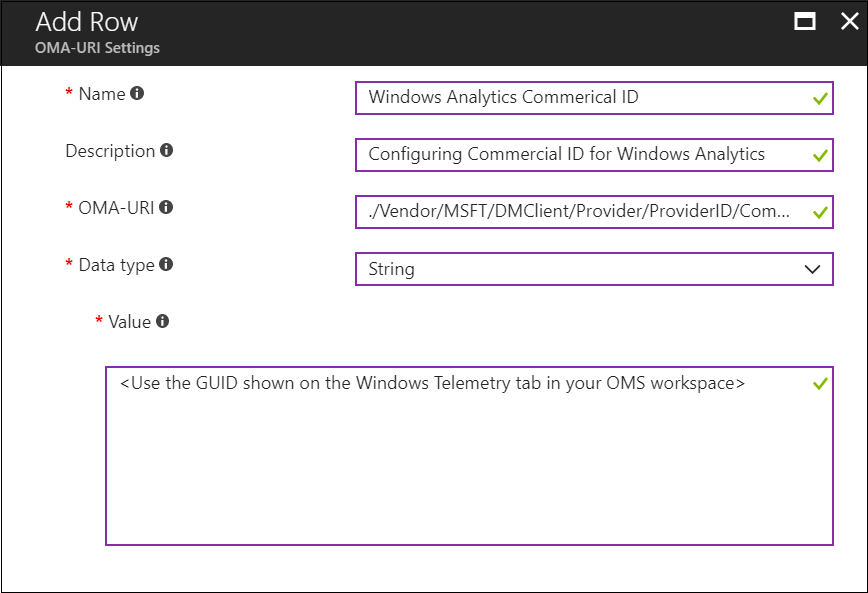

---
# required metadata

title: Configure Windows Update for Business settings in Intune
titleSuffix: "Azure portal"
description: Learn how to configure Windows Update for Business settings in Intune to control updates to Windows 10 devices."
keywords:
author: dougeby
ms.author: dougeby
manager: dougeby
ms.date: 1/30/2018
ms.topic: article
ms.prod:
ms.service: microsoft-intune
ms.technology:

# optional metadata

#ROBOTS:
#audience:
#ms.devlang:
ms.reviewer: coryfe
ms.suite: ems
#ms.tgt_pltfrm:
#ms.custom:

---

# Manage software updates

[!INCLUDE[azure_portal](./includes/azure_portal.md)]

Windows as a Service is the way to update Windows 10 devices. With Windows 10, new Feature Updates and Quality Updates contain the contents of all previous updates. This means that as long as you've installed the latest update, you know that your Windows 10 devices are up-to-date. Unlike with previous versions of Windows, you now must install the entire update instead of part of an update.

By using Windows Update for Business, you can simplify the update management experience so that you don’t need to approve individual updates for groups of devices. You can still manage risk in your environments by configuring an update rollout strategy and Windows Update makes sure that updates are installed at right time. Microsoft Intune provides the ability to configure update settings on devices and gives you the ability to defer update installation. Intune doesn’t store the updates, but only the update policy assignment. Devices access Windows Update directly for the updates. Use Intune to configure and manage **Windows 10 update rings**. An update ring contains a group of settings that configure when and how Windows 10 updates get installed. For example, you can configure the following:

- **Windows 10 Servicing Channel**: Choose whether you want groups of devices to receive updates from the Semi-Annual Channel (Targeted) or from the Semi-Annual Channel.  
- **Deferral Settings**: Configure update deferral settings to delay update installations for groups of devices. Use these settings to give you a staged update roll out so that you can review progress along the way.
- **Pausing**: Postpone the installation of updates if you discover an issue at any point during the update rollout.
- **Maintenance window**: Configure the hours in which updates can be installed.
- **Update type**: Choose the types of updates that get installed. For example, Quality Updates, Feature Updates, or drivers.
- **Installation behavior**: This configures how the update gets installed. For example, does the device automatically restart after the installation?
- **Peer downloading**: You can specify whether to configure peer downloading. If configured, when a device has finished downloading an update, other devices can download the update from that device. This speeds up the download process.

After you create update rings, you assign them to groups of devices. By using update rings, you can create an update strategy that mirrors your business needs. For more information, see [Manage updates using Windows Update for Business](https://technet.microsoft.com/itpro/windows/manage/waas-manage-updates-wufb).

## Before you start

- To update Windows 10 PCs, they must be running at least Windows 10 Pro with the Windows Anniversary update.

- Windows Update supports the following Windows 10 versions:
	- Windows 10
	- Windows 10 Team (for Surface Hub devices)
	- [Windows Holographic for Business](#windows-holographic-for-business-support)

 Devices running Windows 10 Mobile are not supported.

- On Windows devices, **Feedback & diagnostics** > **Diagnostic and usage data** must be set to at least **Basic**.

	

	You can configure this setting manually, or you can use an Intune device restriction profile for Windows 10 and later. To do this, configure the setting **General** > **Diagnostic data submission** to at least **Basic**. For more information about device profiles, see [How to configure device restriction settings](device-restrictions-configure.md).

- In the Intune administration console, there are four settings that control software updates behavior. These settings are part of the general configuration policy for Windows 10 desktop and Mobile devices:
	- **Allow automatic updates**
	- **Allow pre-release features**
	- **Scheduled Install Day**
    - **Scheduled Install Time**

  The classic portal also has a limited number of other Windows 10 updates settings in the device configuration profile. If you have any of these settings configured in the Intune administration console when you migrate to the Azure portal, we strongly recommend that you do the following:

1. Create Windows 10 update rings in the Azure portal with the settings that you need. The **Allow pre-release features** setting is not supported in the Azure portal because it is no longer applicable to the latest Windows 10 builds. You can configure the other three settings, as well as other Windows 10 updates settings, when you create update rings.

  > [!NOTE]
  > Windows 10 updates settings created in the classic portal are not displayed in the Azure portal after migration. However, these settings continue to be applied. If you have migrated any of these settings and edit the migrated policy from the Azure portal, these settings are removed from the policy.

2. Delete the update settings in the classic portal. After you migrate to the Azure portal and add the same settings to an update ring, you must delete the settings in the classic portal to avoid any potential policy conflicts. For example, when the same setting is configured with different values there is a conflict and no easy way to know because the setting configured in the classic portal does not display in the Azure portal.

## How to create and assign update rings

1. Sign into the Azure portal.
2. Choose **More Services** > **Monitoring + Management** > **Intune**.
3. On the **Intune** blade, choose **Software Updates**.
4. On the **Software Updates** blade, choose **Manage** > **Windows 10 Update Rings**.
5. On the blade showing the list of update rings, choose **Create**.
6. On the **Create Update Ring** blade, supply a name and optional description for the update ring, and then choose **Settings**.
7. On the **Settings** blade, configure the following information:
	- **Servicing channel**: Set the channel for which the device receives Windows updates (Semi-Annual Channel (Targeted) or Semi-Annual Channel.
	- **Microsoft updates**: Choose whether to scan for app updates from Microsoft Update.
	- **Windows drivers**: Choose whether to exclude Windows Update drivers during updates.
	- **Automatic update behavior**: Choose how to manage automatic update behavior to scan, download, and install updates. For details, see  [Update/AllowAutoUpdate](https://msdn.microsoft.com/windows/hardware/commercialize/customize/mdm/policy-configuration-service-provider#update-allowautoupdate).
	- **Quality update deferral period (days)** - Specify the number of days for which quality updates are deferred. You can defer receiving these Quality Updates for a period of up to 30 days from their release.  

  	Quality Updates are generally fixes and improvements to existing Windows functionality and are typically published the first Tuesday of every month, though can be released at any time by Microsoft. You can define if, and for how long, you would like to defer receiving Quality Updates following their availability.
	- **Feature update deferral period (days)** - Specify the number of days for which Feature Updates are deferred. You can defer receiving these Feature Updates for a period of 180 days from their release.

	Feature Updates are generally new features for Windows. After you configure the **Servicing channel** setting (Semi-Annual Channel (Targeted) or Semi-Annual Channel, you can then define if, and for how long, you would like to defer receiving Feature Updates following their availability from Microsoft on Windows Update.

	For example:
	**If the Servicing channel is set to Semi-Annual Channel (Targeted)and the deferral period is 30 days**: Let's say that Feature Update X is first publicly available on Windows Update as aSemi-Annual Channel (Targeted) in January. The device will not receive the update until February - 30 days later.

	**If the Servicing channel is set to Semi-Annual Channel and the deferral period is 30 days**: Let's say the Feature Update X is first publicly available on Windows Update as a Semi-Annual Channel (Targeted) in January. Four months later, in April, Feature Update X is released to Semi-Annual Channel. The device will receive the Feature Update 30 days following this Semi-Annual Channel release and will update in May.

	- **Delivery optimization** - Choose the method for which devices will download Windows updates. For details, see [DeliveryOptimization/DODownloadMode](https://docs.microsoft.com/windows/deployment/update/waas-delivery-optimization#download-mode).
1. Once you are done, click **OK**, and then on the **Create Update Ring** blade, click **Create**.

The new update ring is displayed in the list of update rings.

1. To assign the ring, in the list of update rings, select a ring, and then on the <*ring name*> tab, choose **Assignments**.
2. On the next tab, choose **Select groups**, and then choose the groups to which you want to assign this ring.
3. Once you are done, choose **Select** to complete the assignment.

## Update compliance reporting
You can view update compliance in Intune or by using a free solution in the Operations Management Suite (OMS) called Update Compliance.

### Review update compliance in Intune 
<!-- 1352223 -->
Review a policy report to view the deployment status for the Windows 10 update rings that you have configured. 
1. Sign into the Azure portal.
2. Choose **More Services** > **Monitoring + Management** > **Intune**.
3. On the **Intune** blade, choose **Software Updates**.
4. On the **Software Updates** blade, choose **Overview**. From here, you can see general information about the status of any update rings you assigned.
5. Open one of the following reports: 
     
   **For all deployment rings:**
   1. On the **Software updates** > **Windows 10 Update Rings** blade. 
   2. In the **Monitor section**, choose **Per update ring deployment state**.
                   
   **For specific deployment rings:** 
   1. On the **Software updates** > **Windows 10 Update Rings** blade, choose the deployment ring to review.
   2. In the **Monitor** section, choose from the following reports to view more detailed information about the update ring:
      - **Update ring deployment for devices**
      - **Update ring deployment for users**
      - **Per-setting deployment state**

### Review update compliance using OMS
You can monitor Windows 10 update rollouts by using a free solution in the Operations Management Suite (OMS) called Update Compliance. For details, see [Monitor Windows Updates with Update Compliance](https://technet.microsoft.com/itpro/windows/manage/update-compliance-monitor). When you use this solution, you can deploy a commercial ID to any of your Intune managed Windows 10 devices for which you want to report update compliance.

In the Intune console, you can use the OMA-URI settings of a custom policy to configure the commercial ID. For details, see [Intune policy settings for Windows 10 devices in Microsoft Intune](https://docs.microsoft.com/intune-classic/deploy-use/windows-10-policy-settings-in-microsoft-intune).   

The OMA-URI (case sensitive) path for configuring the commercial ID is:
 ./Vendor/MSFT/DMClient/Provider/ProviderID/CommercialID

For example, you can use the following values in **Add or edit OMA-URI Setting**:

- **Setting Name**: Windows Analytics Commercial ID
- **Setting Description**: Configuring commercial ID for Windows Analytics solutions
- **Data Type**: String
- **OMA-URI** (case sensitive): ./Vendor/MSFT/DMClient/Provider/ProviderID/CommercialID
- **Value**: <*Use the GUID shown on the Windows Telemetry tab in your OMS workspace*>

## How to pause updates
You can pause a device from receiving Feature Updates or Quality Updates for a period of up to 35 days from the time you pause the updates. After the maximum days have passed, pause functionality will automatically expire and the device will scan Windows Updates for applicable updates. Following this scan, you can pause the updates again.
1. Sign into the Azure portal.
2. Choose **More Services** > **Monitoring + Management** > **Intune**.
3. On the **Intune** blade, choose **Software Updates**.
4. On the **Software Updates** blade, choose **Manage** > **Windows 10 Update Rings**.
5. On the blade showing the list of update rings, choose the ring you want to pause, and then, choose **...** > **Pause Quality** > or **Pause Feature**, depending on the type of updates you want to pause.

> [!IMPORTANT]
> When you issue a pause command, devices receive this command when they next check into the service. It's possible that before they check in, they might install a scheduled update.
> Additionally, if a targeted device is turned off when you issue the pause command, when you turn it on, it might download and install scheduled updates before it checks in with Intune.

## Windows Holographic for Business Support

Windows Holographic for Business supports the following settings:

- **Automatic update behavior**
- **Microsoft product updates**
- **Servicing channel**