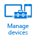
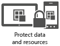

# Configure and manage devices with Microsoft Intune

Use VPN profiles, wifi profiles, and configuration policies to give  employees access to your network while meeting your company's security requirements.

Your users want to get their email and access their work on many different devices, and they want the freedom to do so wherever they are. This presents you with opportunities to increase productivity, but also presents problems around the security of your company data.

[!INCLUDE[wit_nextref](../Token/wit_nextref_md.md)] can solve these problems with  VPN profiles, Wi-Fi profiles, and configuration policies.

## Use VPN profiles or wifi profiles to enable access to company resources
You can make it easy for employees to get their email or use Wi-Fi or VPN to access company resources by taking advantage of [resource access profiles](https://technet.microsoft.com/library/dn997277.aspx). These profiles let you pre-configure devices with the access settings they need for email and company files. For example, many people use a Virtual Private network (VPN) connection to work remotely. The settings to create a VPN connection (or **profile**) are complex, and a typical end user might not understand these. [!INCLUDE[wit_nextref](../Token/wit_nextref_md.md)] lets you pre-configure these settings  and  deploy them to users' devices. This means that employees don't have to enter complex VPN settings, they can just select the VPN profile from a list and  automatically connect. Additionally, you can take advantage of the security capabilities of certificates to secure these connections.

## Manage settings and features with Intune policies
Imagine that you are the IT administrator of a design company. You are working on a new product and you do not want details of the product to leak to the public. You decide that for maximum security, you want to disable the use of the camera on employees mobile devices. [!INCLUDE[wit_nextref](../Token/wit_nextref_md.md)] lets you use a **configuration policy** to accomplish this aim easily.

Although [!INCLUDE[wit_nextref](../Token/wit_nextref_md.md)] provides [a wide range of settings](https://technet.microsoft.com/library/dn646984.aspx) to configure devices, there might be cases where the setting you need is not available. In many cases, you can solve this problem by using a custom policy which allows you to configure OMA-URI settings, a common standard for configuring mobile devices to set the required values.

## Manage computers
Although you can [enroll computers that run Windows 8.1 and later](https://technet.microsoft.com/library/dn764959.aspx) as mobile devices, in some cases, you may want to manage them by installing the Intune computer client on them. [Managing computers with Intune](https://technet.microsoft.com/library/dn646959.aspx) gives you some options that aren't available when you manage them as mobile devices, such as managing Windows software updates, EndPoint protection, and Windows Firewall settings.

## See Also
[Documentation for Microsoft Intune](../Topic/Documentation-for-Microsoft-Intune.md)

