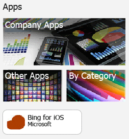

# Deploy apps to mobile devices in Microsoft Intune
Now that you've [learned the basics](https://technet.microsoft.com/library/dn646955.aspx) about [!INCLUDE[wit_firstref](../Token/wit_firstref_md.md)] app deployment, you'll now learn how to configure and deploy apps to devices enrolled with [!INCLUDE[wit_nextref](../Token/wit_nextref_md.md)]. This generally involves three steps:

-   [Configure the app](#BKMK_Conf)

-   [Deploy the app](#BKMK_Depl)

-   [Monitor the app](#BKMK_Monitor)

For information about how to deploy and manage apps you volume-purchased from an app store, see one of the following topics:
* [Manage iOS apps you purchased through a volume-purchase program with Microsoft Intune](Manage-iOS-apps-you-purchased-through-a-volume-purchase-program-with-Microsoft-Intune.md)
* [Manage apps you purchased from the Windows Store for Business with Microsoft Intune](Manage-apps-you-purchased-from-the-Windows-Store-for-Business-with-Microsoft-Intune.md)

For information about how to update and retire apps, see [Update apps using Microsoft Intune](../Topic/Update-apps-using-Microsoft-Intune.md).

> [!IMPORTANT]
> The information in this topic helps you to deploy apps to [enrolled Windows PCs](https://technet.microsoft.com/library/mt346003.aspx) and other mobile devices. If you want to deploy apps to  [Windows PCs that you manage using the client software](https://technet.microsoft.com/library/dn646959.aspx), see [Deploy apps to Windows PCs in Microsoft Intune](../Topic/Deploy-apps-to-Windows-PCs-in-Microsoft-Intune.md).

## Configure the app
In this procedure, you'll use the Intune Software Publisher to configure the properties of the app and, where applicable, upload it to your cloud storage space.

#### To configure an app

1.  In the [Microsoft Intune administrator console](https://manage.microsoft.com), click **Apps** &gt; **Add Apps** to start the Intune software publisher.

    > [!TIP]
    > You might need to enter your Intune username and password before the publisher starts.

2.  On the **Software setup** page of the software publisher, configure the following:

    **Select how this software is made available to devices** - Choose from:

    -   **Software installer**, then specify:

        |Setting|Details|
        |-----------|-----------|
        |**Select the software installer file type**|This indicates the type of software you want to deploy. For example, if you want to install an iOS app, choose **App Package for iOS (&#42;.ipa file)**.|
        |**Specify the location of the software setup files**|Enter the location of the installation files or click **Browse** to select the location from a list.|
        |**Include additional files and subfolders from the same folder**|For the **Windows Installer** file type only  Some software that uses Windows Installer requires supporting files which are typically found in the same folder as the installation files. Select this option if you also want to deploy these files.|
        This installation type uses some of your cloud storage space.

    -   **External link**, then specify:

        |Setting|Details|
        |-----------|-----------|
        |**Specify the URL**|Specify the URL to one of the following:  The app store URL of the app you want to deploy. For example, if you want to deploy the Microsoft Remote Desktop app for Android, specify **https://play.google.com/store/apps/details?id=com.microsoft.rdc.android**. To find the URL of the app, use a search engine to find the store page containing the app. For example, to find the Remote Desktop app, you could search **Microsoft Remote Desktop Android**.  A web site. Intune will deploy a shortcut icon to the site to the device (known as a web clip).  An app on the web. Intune will deploy a shortcut icon to the app on the device.
        |**Require a managed browser to open this link (Android and iOS only)**|When you deploy a link to a website or web app to users, they will only be able to open it in the Intune managed browser which must be installed on their device.  For more details about the managed browser, see [Manage Internet access using managed browser policies with Microsoft Intune](Manage-Internet-access-using-managed-browser-policies-with-Microsoft-Intune.md).
        This installation type does not use any of your cloud storage space.

    -   **Managed iOS app from the app store**, then specify:

        |Setting|Details|
        |-----------|-----------|
        |**Specify the URL**|Enter the app store URL of the app you want to deploy. For example, if you want to deploy the Microsoft Work Folders app for iOS, specify **https://itunes.apple.com/us/app/work-folders/id950878067?mt=8**.|
        This installation type does not use any of your cloud storage space.

3.  On the **Software description** page, configure the following:

    > [!TIP]
    > Depending on the installer type you are using, some of these values might have been automatically entered, or might not appear.

    |Setting|Details|
    |-----------|-----------|
    |**Publisher**|Enter the name of the publisher of the app.|
    |**Name**|Enter the name of the app as it will be displayed in the company portal.  Make sure all app names you use are unique. If the same app name exists twice, only one of the apps will be displayed to users in the company portal.|
    |**Description**|Enter a description for the app. This will be displayed to users in the company portal.|
    |**URL for software information**|Available only if you selected **Software installer**.  (optional) Enter a URL to a website that contains information about this app. The URL will be displayed to users in the company portal.|
    |**Privacy URL**|Available only if you selected **Software installer**.  (optional) Enter a URL to a website that contains privacy information for this app. The URL will be displayed to users in the company portal.|
    |**Category**|(optional) Select one of the built-in app categories. This will make it easier for users to find the app when they browse the company portal.|
    |**Display this as a featured app and highlight it in the company portal**|Display the app prominently on the main page of the company portal when users browse for apps.|
    |**Icon**|(optional) Upload an icon that will be associated with the app. This is the icon that will be displayed with the app when users browse the company portal.|

4.  On the **Requirements** page, select the requirements that must be met before the app can start to install on a device. For example, for an app package for iOS, you can select the minimum version of iOS required, and the type of device it must be, like an iPhone, or an iPad.

    > [!TIP]
    > The **Requirements** page is not displayed for all types of apps.

5.  Further wizard pages are displayed when you choose the **Windows Installer** file type. This file type is used when you deploy software to PCs running Windows 10 or later that are enrolled with Intune.

6.  On the **Summary** page, review the information you specified. Once you are ready, click **Upload**.

7.  Click **Close** to finish.

The app is displayed on the **Apps** node of the **Apps** workspace.

## Deploy the app
In this procedure, you'll deploy the app to selected devices or users.

#### To deploy the app

1.  In the [Microsoft Intune administrator console](https://manage.microsoft.com), click **Apps** &gt; **Apps** to view the list of apps you manage.

2.  Select the app you want to deploy, and then click **Manage Deployment**.

3.  In the *&lt;app name&gt;* dialog box, on the **Select Groups** page, choose the user or device groups to which you want to deploy the app.

4.  On the **Deployment Action** page, configure the following:

    |Setting|Details|
    |-----------|-----------|
    |**Approval**|Choose whether the deployment is:  **Required** (mandatory install)  **Available** (users install from the company portal on demand)  **Not Applicable** (the app is not installed or shown in the company portal)  **Uninstall** (the app will be uninstalled from targeted devices)|
    |**Deadline**|For required installations, choose how soon the app will be deployed. You can choose from the predefined values, or select **Custom** to configure your own deadline.|

5.  If the app you are deploying can be configured by a [mobile application management policy](https://technet.microsoft.com/library/dn878026.aspx), the **Mobile App Management** page is displayed. On this page, choose the mobile application management policy you want to associate with this app.

    [See which Microsoft apps are compatible with mobile application management policies](https://technet.microsoft.com/library/dn708489.aspx).

6.  If the app you are deploying is compatible with Intune VPN profiles, the **VPN Profile** page is displayed. On this page, you can choose to associate iOS apps with a VPN profile you have deployed. The VPN connection will be automatically opened when the app is launched. To make a VPN profile available, it must have the **Per-app VPN** profile setting enabled.
    For information about how to configure VPN profiles, including support for associating profiles with apps, see [Help users connect to their work using VPN profiles with Microsoft Intune](../Topic/Help-users-connect-to-their-work-using-VPN-profiles-with-Microsoft-Intune.md).

|||
|-|-|
||If you deployed the app as **Available**, it will be displayed in the company portal on users device from where they can install the app. For example, in this screenshot, the Bing for iOS app was deployed using the **External Link** installation type, with a custom icon, and the option **Display this as a featured app and highlight it in the company portal** was selected.|
||If you deployed the app as required, the user will get a notification that an app is ready to install. For example, in this screenshot, the Work Folders for iOS app was deployed using the **Managed iOS app from the app store** installation type.|

## Monitor the app
You can see the apps you manage, and their deployment status in the [!INCLUDE[wit_nextref](../Token/wit_nextref_md.md)] console.

### To view the apps you manage and their status
In the **Apps** workspace, click the **Apps** node.

The list of apps you manage will be displayed. You can click on any app to see an installation status in the lower pane of the console windows. Click the status to see more details. For example, if the status shows **1 user has this software available**, you can click the message to see the name of the user.

> [!TIP]
> You can use the **Filters** drop-down list to show only apps that meet the criteria you specify, like apps that failed to install, or apps that were successfully deployed.
> 
> 

Additionally, the **Dashboard** workspace shows an overview of the status of your apps. If you click anywhere in the overview, you'll be taken to the list of apps.

### To view more detailed information about an app
In the list of apps, select any app, and then click **View Properties**.

On the **Software Properties** page for the app, click one of these tabs:

-   **General** - Shows general information about the app and its installation status.

-   **Devices** - Shows the devices that successfully installed a targeted deployment of the app.

-   **Users** - Shows the users whose devices successfully installed a targeted deployment of the app.

As before, you can use the **Filters** drop-down list to configure the values shown on each of the tabs.

## See Also
[Deploy and configure apps with Microsoft Intune](../Topic/Deploy-and-configure-apps-with-Microsoft-Intune.md)

