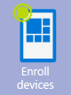
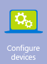

# Real-world solutions to help you manage mobile devices

To effectively manage your users and devices often involves using more than one product or service. Microsoft produces a range of scenarios and solutions that can help you to understand how these different products and services can work together to help you reach your goals.

|Solution or scenario name|How can it help you|
|-----------------------------|-----------------------|
|[Bring Your Own Device (BYOD) Design Considerations Guide](http://technet.microsoft.com/library/dn656905.aspx)|Use this guide to help you address common issues and questions about BYOD and to help you evaluate your requirements for a BYOD infrastructure design.|
|[Secure access to company resources from any location on any device](http://technet.microsoft.com/library/dn550982.aspx)|Use this guide to help you understand the design, implementation and security considerations you need to consider when allowing your staff to use their personal devices to connect to company resources.|
|[Streamlined management for mobile devices and computers in a hybrid environment](http://technet.microsoft.com/library/dn582037.aspx)|Use this guide if you have an existing [!INCLUDE[cmshort](../Token/cmshort_md.md)] infrastructure and want to extend this with [!INCLUDE[wit_firstref](../Token/wit_firstref_md.md)] to let your users work from their own devices.|
|[Manage mobile devices and PCs from the cloud](http://technet.microsoft.com/library/dn715906.aspx)|Use this guide to learn about the solution design and implementation steps that Microsoft recommends for managing computers and mobile devices from the cloud.|
|[Automate and manage Windows operating system deployments](http://technet.microsoft.com/library/dn818437.aspx)|Use this solution guide to understand the Microsoft recommended processes for creating and deploying Windows operating systems.|

## See Also
[Start using Microsoft Intune](../Topic/Start-using-Microsoft-Intune.md)
[Sign up for a free trial](https://account.manage.microsoft.com/Signup/MainSignUp.aspx?OfferId=40BE278A-DFD1-470a-9EF7-9F2596EA7FF9&ali=1)

