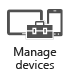

# Retire data and devices from Microsoft Intune management

There comes a point when an employee either parts ways with the company, or with their device. In such cases, you need to be able to ensure
		   that neither the employee nor anyone using their device can access company resources. You may also want to make sure that any company 
			information on the device is removed.

## Protect company data on lost or stolen devices
When an employee loses a mobile device, or if that device is stolen, your first concern is to make sure that any company information on that device can’t be read. You also want to make sure that the device can’t be used to log on to company resources. You have several options:

-   You can [ selectively wipe company data and apps ](https://technet.microsoft.com/library/jj676679.aspx) from the device. This is the preferred action for employees who have enrolled their own devices in Intune because it does not affect personal information on the device. Selective wipe also removes the device from Intune, which means it will no longer have the credentials necessary to log on to company resources such as Microsoft SharePoint, email, or Office 365.

-   You can also perform a full wipe, which [ resets a device to factory settings](https://technet.microsoft.com/library/jj676679.aspx). This makes sure no data – personal or corporate – falls into the wrong hands and it's the preferred action for company-owned devices. It also removes the device from Intune.

**Reset passcodes when users are locked out of their devices**
Since the first step in protecting company data on mobile devices is to require a passcode to use the device, sometimes you have to [reset a passcode](https://technet.microsoft.com/library/jj676679.aspx#BKMK_passcode) or help an employee do so, either by removing the passcode or setting a temporary passcode remotely.

**Bypass Activation Lock on iOS devices**
When company-owned iOS devices are protected by Activation Lock, and the device is lost or stolen, Activation Lock can keep the device and its data from being used by the wrong people. However, if you are able to recover the device, or if an employee returns the device but forgets to turn off Activation lock, you need to unlock the device. If you don't have the user's Apple ID and password to unlock it, you can use [Intune Activation Lock bypass](https://technet.microsoft.com/library/mt414176.aspx).

## Revoke access to the company network
When an employee leaves your company, you also want to make that they don’t take company data with them, whether they’ve been using their own device or have neglected to turn in company-owned hardware.  In the first case, [selectively wiping the employee’s personal device](https://technet.microsoft.com/library/jj676679.aspx) is sufficient. In the second case, you can [remotely lock ](https://technet.microsoft.com/library/jj676679.aspx) it. This keeps both company information and company hardware from being misused, although you may have to write the device off as a loss.

You also want to revoke the license from the employee's Intune user account. This frees up the license and you can assign it to a new user  account.

## Retire hardware
Sometimes, it’s the device itself that has reached its end of life. In such cases, [resetting it to factory settings](https://technet.microsoft.com/library/jj676679.aspx) removes all data and removes the device from Intune. Then you can get rid of the hardware according to your company’s policy.

**Audit inventory and license usage**
You can keep track of changes to inventory and licenses through the built-in [inventory reports](https://technet.microsoft.com/library/dn646977.aspx).

## See Also
[Documentation for Microsoft Intune](../Topic/Documentation-for-Microsoft-Intune.md)

